### 请你谈谈对volatile的理解

​	`Package java.util.concurrent`---> `AtomicInteger`  `Lock` `ReadWriteLock`

#### volatile是java虚拟机提供的轻量级的同步机制

保证可见性、不保证原子性、禁止指令重排

1. 保证可见性

   当多个线程访问同一个变量时，一个线程修改了这个变量的值，其他线程能够立即看到修改的值

   当不添加volatile关键字时示例：

   ```java
   package com.jian8.juc;
   
   import java.util.concurrent.TimeUnit;
   
   /**
    * 1验证volatile的可见性
    * 1.1 如果int num = 0，number变量没有添加volatile关键字修饰
    * 1.2 添加了volatile，可以解决可见性
    */
   public class VolatileDemo {
   
       public static void main(String[] args) {
           visibilityByVolatile();//验证volatile的可见性
       }
   
       /**
        * volatile可以保证可见性，及时通知其他线程，主物理内存的值已经被修改
        */
       public static void visibilityByVolatile() {
           MyData myData = new MyData();
   
           //第一个线程
           new Thread(() -> {
               System.out.println(Thread.currentThread().getName() + "\t come in");
               try {
                   //线程暂停3s
                   TimeUnit.SECONDS.sleep(3);
                   myData.addToSixty();
                   System.out.println(Thread.currentThread().getName() + "\t update value:" + myData.num);
               } catch (Exception e) {
                   // TODO Auto-generated catch block
                   e.printStackTrace();
               }
           }, "thread1").start();
           //第二个线程是main线程
           while (myData.num == 0) {
               //如果myData的num一直为零，main线程一直在这里循环
           }
           System.out.println(Thread.currentThread().getName() + "\t mission is over, num value is " + myData.num);
       }
   }
   
   class MyData {
       //    int num = 0;
       volatile int num = 0;
   
       public void addToSixty() {
           this.num = 60;
       }
   }
   ```

   输出结果：

   ```java
   thread1	 come in
   thread1	 update value:60
   //线程进入死循环
   ```

   当我们加上`volatile`关键字后，`volatile int num = 0;`输出结果为：

   ```java
   thread1	 come in
   thread1	 update value:60
   main	 mission is over, num value is 60
   //程序没有死循环，结束执行
   ```

   

2. ==不保证原子性==

   原子性：不可分割、完整性，即某个线程正在做某个具体业务时，中间不可以被加塞或者被分割，需要整体完整，要么同时成功，要么同时失败

   验证示例（变量添加volatile关键字，方法不添加synchronized）：

   ```java
   package com.jian8.juc;
   
   import java.util.concurrent.TimeUnit;
   import java.util.concurrent.atomic.AtomicInteger;
   
   /**
    * 1验证volatile的可见性
    *  1.1 如果int num = 0，number变量没有添加volatile关键字修饰
    * 1.2 添加了volatile，可以解决可见性
    *
    * 2.验证volatile不保证原子性
    *  2.1 原子性指的是什么
    *      不可分割、完整性，即某个线程正在做某个具体业务时，中间不可以被加塞或者被分割，需要整体完整，要么同时成功，要么同时失败
    */
   public class VolatileDemo {
   
       public static void main(String[] args) {
   //        visibilityByVolatile();//验证volatile的可见性
           atomicByVolatile();//验证volatile不保证原子性
       }
       
       /**
        * volatile可以保证可见性，及时通知其他线程，主物理内存的值已经被修改
        */
   	//public static void visibilityByVolatile(){}
       
       /**
        * volatile不保证原子性
        * 以及使用Atomic保证原子性
        */
       public static void atomicByVolatile(){
           MyData myData = new MyData();
           for(int i = 1; i <= 20; i++){
               new Thread(() ->{
                   for(int j = 1; j <= 1000; j++){
                       myData.addSelf();
                       myData.atomicAddSelf();
                   }
               },"Thread "+i).start();
           }
           //等待上面的线程都计算完成后，再用main线程取得最终结果值
           try {
               TimeUnit.SECONDS.sleep(4);
           } catch (InterruptedException e) {
               e.printStackTrace();
           }
           while (Thread.activeCount()>2){
               Thread.yield();
           }
           System.out.println(Thread.currentThread().getName()+"\t finally num value is "+myData.num);
           System.out.println(Thread.currentThread().getName()+"\t finally atomicnum value is "+myData.atomicInteger);
       }
   }
   
   class MyData {
       //    int num = 0;
       volatile int num = 0;
   
       public void addToSixty() {
           this.num = 60;
       }
   
       public void addSelf(){
           num++;
       }
       
       AtomicInteger atomicInteger = new AtomicInteger();
       public void atomicAddSelf(){
           atomicInteger.getAndIncrement();
       }
   }
   ```

   执行三次结果为：

   ```java
   //1.
   main	 finally num value is 19580	
   main	 finally atomicnum value is 20000
   //2.
   main	 finally num value is 19999
   main	 finally atomicnum value is 20000
   //3.
   main	 finally num value is 18375
   main	 finally atomicnum value is 20000
   //num并没有达到20000
   ```

   

3. 禁止指令重排

   有序性：在计算机执行程序时，为了提高性能，编译器和处理器常常会对**==指令做重拍==**，一般分以下三种

   ```mermaid
   graph LR
   	源代码 --> id1["编译器优化的重排"]
   	id1 --> id2[指令并行的重排]
   	id2 --> id3[内存系统的重排]
   	id3 --> 最终执行的指令
   	style id1 fill:#ff8000;
   	style id2 fill:#fab400;
   	style id3 fill:#ffd557;
   ```

   单线程环境里面确保程序最终执行结果和代码顺序执行的结果一致。

   处理器在进行重排顺序是必须要考虑指令之间的**==数据依赖性==**

   ==多线程环境中线程交替执行，由于编译器优化重排的存在，两个线程中使用的变量能否保证一致性时无法确定的，结果无法预测==

   重排代码实例：

   声明变量：`int a,b,x,y=0`

   | 线程1          | 线程2          |
   | -------------- | -------------- |
   | x = a;         | y = b;         |
   | b = 1;         | a = 2;         |
   | 结          果 | x = 0      y=0 |

   如果编译器对这段程序代码执行重排优化后，可能出现如下情况：

   | 线程1          | 线程2          |
   | -------------- | -------------- |
   | b = 1;         | a = 2;         |
   | x= a;          | y = b;         |
   | 结          果 | x = 2      y=1 |

   这个结果说明在多线程环境下，由于编译器优化重排的存在，两个线程中使用的变量能否保证一致性是无法确定的

   volatile实现禁止指令重排，从而避免了多线程环境下程序出现乱序执行的现象

   **==内存屏障==**（Memory Barrier）又称内存栅栏，是一个CPU指令，他的作用有两个：

   1. 保证特定操作的执行顺序
   2. 保证某些变量的内存可见性（利用该特性实现volatile的内存可见性）

   由于编译器和处理器都能执行指令重排优化。如果在之零件插入一i奥Memory Barrier则会告诉编译器和CPU，不管什么指令都不能和这条Memory Barrier指令重排顺序，也就是说==通过插入内存屏障禁止在内存屏障前后的指令执行重排序优化==。内存屏障另外一个作用是强制刷出各种CPU的缓存数据，因此任何CPU上的线程都能读取到这些数据的最新版本。

   ```mermaid
   graph TB
       subgraph 
       bbbb["对Volatile变量进行读操作时，<br>回在读操作之前加入一条load屏障指令，<br>从内存中读取共享变量"]
       ids6[Volatile]-->red3[LoadLoad屏障]
       red3-->id7["禁止下边所有普通读操作<br>和上面的volatile读重排序"]
       red3-->red4[LoadStore屏障]
       red4-->id9["禁止下边所有普通写操作<br>和上面的volatile读重排序"]
       red4-->id8[普通读]
       id8-->普通写
       end
       subgraph 
       aaaa["对Volatile变量进行写操作时，<br>回在写操作后加入一条store屏障指令，<br>将工作内存中的共享变量值刷新回到主内存"]
       id1[普通读]-->id2[普通写]
       id2-->red1[StoreStore屏障]
       red1-->id3["禁止上面的普通写和<br>下面的volatile写重排序"]
       red1-->id4["Volatile写"]
       id4-->red2[StoreLoad屏障]
       red2-->id5["防止上面的volatile写和<br>下面可能有的volatile读写重排序"]
       end
       style red1 fill:#ff0000;
       style red2 fill:#ff0000;
       style red4 fill:#ff0000;
       style red3 fill:#ff0000;
       style aaaa fill:#ffff00;
       style bbbb fill:#ffff00;
   ```

   

#### JMM（java内存模型）

JMM（Java Memory Model）本身是一种抽象的概念，并不真实存在，他描述的时一组规则或规范，通过这组规范定义了程序中各个变量（包括实例字段，静态字段和构成数组对象的元素）的访问方式。

**JMM关于同步的规定：**

1. 线程解锁前，必须把共享变量的值刷新回主内存
2. 线程加锁前，必须读取主内存的最新值到自己的工作内存
3. 加锁解锁时同一把锁

由于JVM运行程序的实体是线程，而每个线程创建时JVM都会为其创建一个工作内存（有的成为栈空间），工作内存是每个线程的私有数据区域，而java内存模型中规定所有变量都存储在**==主内存==**，主内存是贡献内存区域，所有线程都可以访问，**==但线程对变量的操作（读取赋值等）必须在工作内存中进行，首先概要将变量从主内存拷贝到自己的工作内存空间，然后对变量进行操作，操作完成后再将变量写回主内存，==**不能直接操作主内存中的变量，各个线程中的工作内存中存储着主内存的**==变量副本拷贝==**，因此不同的线程件无法访问对方的工作内存，线程间的通信（传值）必须通过主内存来完成，期间要访问过程如下图：.jpg)


1. 可见性
2. 原子性
3. 有序性


#### 你在那些地方用过volatile

当普通单例模式在多线程情况下：

```java
public class SingletonDemo {
    private static SingletonDemo instance = null;

    private SingletonDemo() {
        System.out.println(Thread.currentThread().getName() + "\t 构造方法SingletonDemo（）");
    }

    public static SingletonDemo getInstance() {
        if (instance == null) {
            instance = new SingletonDemo();
        }
        return instance;
    }

    public static void main(String[] args) {
        //构造方法只会被执行一次
//        System.out.println(getInstance() == getInstance());
//        System.out.println(getInstance() == getInstance());
//        System.out.println(getInstance() == getInstance());

        //并发多线程后，构造方法会在一些情况下执行多次
        for (int i = 0; i < 10; i++) {
            new Thread(() -> {
                SingletonDemo.getInstance();
            }, "Thread " + i).start();
        }
    }
}
```

其构造方法在一些情况下会被执行多次

解决方式：

1. **单例模式DCL代码**

   DCL （Double Check Lock双端检锁机制）在加锁前和加锁后都进行一次判断

   ```java
       public static SingletonDemo getInstance() {        if (instance == null) {            synchronized (SingletonDemo.class) {                if (instance == null) {                    instance = new SingletonDemo();                }            }        }        return instance;    }
   ```

   **大部分运行结果构造方法只会被执行一次**，但指令重排机制会让程序很小的几率出现构造方法被执行多次

   **==DCL（双端检锁）机制不一定线程安全==**，原因时有指令重排的存在，加入volatile可以禁止指令重排

   原因是在某一个线程执行到第一次检测，读取到instance不为null时，instance的引用对象可能==没有完成初始化==。instance=new SingleDemo();可以被分为一下三步（伪代码）：

   ```java
   memory = allocate();//1.分配对象内存空间instance(memory);	//2.初始化对象instance = memory;	//3.设置instance执行刚分配的内存地址，此时instance!=null
   ```

   步骤2和步骤3不存在数据依赖关系，而且无论重排前还是重排后程序的执行结果在单线程中并没有改变，因此这种重排优化时允许的，**如果3步骤提前于步骤2，但是instance还没有初始化完成**

   但是指令重排只会保证串行语义的执行的一致性（单线程），但并不关心多线程间的语义一致性。

   ==所以当一条线程访问instance不为null时，由于instance示例未必已初始化完成，也就造成了线程安全问题。==

2. **单例模式volatile代码**

   为解决以上问题，可以将SingletongDemo实例上加上volatile

   ```java
   private static volatile SingletonDemo instance = null;
   ```

### CAS你知道吗

#### compareAndSet----比较并交换

AtomicInteger.conpareAndSet(int expect, indt update)

```java
    public final boolean compareAndSet(int expect, int update) {        return unsafe.compareAndSwapInt(this, valueOffset, expect, update);    }
```

第一个参数为拿到的期望值，如果期望值没有一致，进行update赋值，如果期望值不一致，证明数据被修改过，返回fasle，取消赋值

例子：

```java
package com.jian8.juc.cas;import java.util.concurrent.atomic.AtomicInteger;/** * 1.CAS是什么？ * 1.1比较并交换 */public class CASDemo {    public static void main(String[] args) {       checkCAS();    }    public static void checkCAS(){        AtomicInteger atomicInteger = new AtomicInteger(5);        System.out.println(atomicInteger.compareAndSet(5, 2019) + "\t current data is " + atomicInteger.get());        System.out.println(atomicInteger.compareAndSet(5, 2014) + "\t current data is " + atomicInteger.get());    }}
```

输出结果为：

```java
true	 current data is 2019false	 current data is 2019
```

#### CAS底层原理？对Unsafe的理解

比较当前工作内存中的值和主内存中的值，如果相同则执行规定操作，否则继续比较知道主内存和工作内存中的值一直为止

1. atomicInteger.getAndIncrement();

   ```java
       public final int getAndIncrement() {        return unsafe.getAndAddInt(this, valueOffset, 1);    }
   ```

2. Unsafe

   - 是CAS核心类，由于Java方法无法直接访问地层系统，需要通过本地（native）方法来访问，Unsafe相当于一个后门，基于该类可以直接操作特定内存数据。Unsafe类存在于`sun.misc`包中，其内部方法操作可以像C的指针一样直接操作内存，因为Java中CAS操作的执行依赖于Unsafe类的方法。

     **Unsafe类中的所有方法都是native修饰的，也就是说Unsafe类中的方法都直接调用操作系统底层资源执行相应任务**

   - 变量valueOffset，表示该变量值在内存中的偏移地址，因为Unsafe就是根据内存便宜地址获取数据的

   - 变量value用volatile修饰，保证多线程之间的可见性

3. CAS是什么

   CAS全称呼Compare-And-Swap，它是一条CPU并发原语

   他的功能是判断内存某个位置的值是否为预期值，如果是则更改为新的值，这个过程是原子的。

   CAS并发原语体现在JAVA语言中就是sun.misc.Unsafe类中各个方法。调用Unsafe类中的CAS方法，JVM会帮我们实现CAS汇编指令。这是一种完全依赖于硬件的功能，通过他实现了原子操作。由于CAS是一种系统原语，原语属于操作系统用语范畴，是由若干条指令组成的，用于完成某个功能的一个过程，并且原语的执行必须是连续的，在执行过程中不允许被中断，也就是说CAS是一条CPU的原子指令，不会造成数据不一致问题。

   ```java
   //unsafe.getAndAddInt    public final int getAndAddInt(Object var1, long var2, int var4) {        int var5;        do {            var5 = this.getIntVolatile(var1, var2);        } while(!this.compareAndSwapInt(var1, var2, var5, var5 + var4));        return var5;    }
   ```

   var1 AtomicInteger对象本身

   var2 该对象的引用地址

   var4 需要变动的数据

   var5 通过var1 var2找出的主内存中真实的值

   用该对象前的值与var5比较；

   如果相同，更新var5+var4并且返回true，

   如果不同，继续去之然后再比较，直到更新完成

#### CAS缺点

1. ** 循环时间长，开销大**

   例如getAndAddInt方法执行，有个do while循环，如果CAS失败，一直会进行尝试，如果CAS长时间不成功，可能会给CPU带来很大的开销

2. **只能保证一个共享变量的原子操作**

   对多个共享变量操作时，循环CAS就无法保证操作的原子性，这个时候就可以用锁来保证原子性

3. **ABA问题**

### 原子类AtomicInteger的ABA问题？原子更新引用？

#### ABA如何产生

CAS算法实现一个重要前提需要去除内存中某个时刻的数据并在当下时刻比较并替换，那么在这个时间差类会导致数据的变化。

比如**线程1**从内存位置V取出A，**线程2**同时也从内存取出A，并且线程2进行一些操作将值改为B，然后线程2又将V位置数据改成A，这时候线程1进行CAS操作发现内存中的值依然时A，然后线程1操作成功。

==尽管线程1的CAS操作成功，但是不代表这个过程没有问题==

#### 如何解决？原子引用

示例代码：

```java
package juc.cas;import lombok.AllArgsConstructor;import lombok.Getter;import lombok.ToString;import java.util.concurrent.atomic.AtomicReference;public class AtomicRefrenceDemo {    public static void main(String[] args) {        User z3 = new User("张三", 22);        User l4 = new User("李四", 23);        AtomicReference<User> atomicReference = new AtomicReference<>();        atomicReference.set(z3);        System.out.println(atomicReference.compareAndSet(z3, l4) + "\t" + atomicReference.get().toString());        System.out.println(atomicReference.compareAndSet(z3, l4) + "\t" + atomicReference.get().toString());    }}@Getter@ToString@AllArgsConstructorclass User {    String userName;    int age;}
```

输出结果

```java
true	User(userName=李四, age=23)false	User(userName=李四, age=23)
```

#### 时间戳的原子引用

新增机制，修改版本号

```java
package com.jian8.juc.cas;import java.util.concurrent.TimeUnit;import java.util.concurrent.atomic.AtomicReference;import java.util.concurrent.atomic.AtomicStampedReference;/** * ABA问题解决 * AtomicStampedReference */public class ABADemo {    static AtomicReference<Integer> atomicReference = new AtomicReference<>(100);    static AtomicStampedReference<Integer> atomicStampedReference = new AtomicStampedReference<>(100, 1);    public static void main(String[] args) {        System.out.println("=====以下时ABA问题的产生=====");        new Thread(() -> {            atomicReference.compareAndSet(100, 101);            atomicReference.compareAndSet(101, 100);        }, "Thread 1").start();        new Thread(() -> {            try {                //保证线程1完成一次ABA操作                TimeUnit.SECONDS.sleep(1);            } catch (InterruptedException e) {                e.printStackTrace();            }            System.out.println(atomicReference.compareAndSet(100, 2019) + "\t" + atomicReference.get());        }, "Thread 2").start();        try {            TimeUnit.SECONDS.sleep(2);        } catch (InterruptedException e) {            e.printStackTrace();        }        System.out.println("=====以下时ABA问题的解决=====");        new Thread(() -> {            int stamp = atomicStampedReference.getStamp();            System.out.println(Thread.currentThread().getName() + "\t第1次版本号" + stamp);            try {                TimeUnit.SECONDS.sleep(2);            } catch (InterruptedException e) {                e.printStackTrace();            }            atomicStampedReference.compareAndSet(100, 101, atomicStampedReference.getStamp(), atomicStampedReference.getStamp() + 1);            System.out.println(Thread.currentThread().getName() + "\t第2次版本号" + atomicStampedReference.getStamp());            atomicStampedReference.compareAndSet(101, 100, atomicStampedReference.getStamp(), atomicStampedReference.getStamp() + 1);            System.out.println(Thread.currentThread().getName() + "\t第3次版本号" + atomicStampedReference.getStamp());        }, "Thread 3").start();        new Thread(() -> {            int stamp = atomicStampedReference.getStamp();            System.out.println(Thread.currentThread().getName() + "\t第1次版本号" + stamp);            try {                TimeUnit.SECONDS.sleep(4);            } catch (InterruptedException e) {                e.printStackTrace();            }            boolean result = atomicStampedReference.compareAndSet(100, 2019, stamp, stamp + 1);            System.out.println(Thread.currentThread().getName() + "\t修改是否成功" + result + "\t当前最新实际版本号：" + atomicStampedReference.getStamp());            System.out.println(Thread.currentThread().getName() + "\t当前最新实际值：" + atomicStampedReference.getReference());        }, "Thread 4").start();    }}
```

输出结果：

```java
=====以下时ABA问题的产生=====true	2019=====以下时ABA问题的解决=====Thread 3	第1次版本号1Thread 4	第1次版本号1Thread 3	第2次版本号2Thread 3	第3次版本号3Thread 4	修改是否成功false	当前最新实际版本号：3Thread 4	当前最新实际值：100
```

### 我们知道ArrayList是线程不安全的，请编写一个不安全的案例并给出解决方案

HashSet与ArrayList一致 HashMap

HashSet底层是一个HashMap，存储的值放在HashMap的key里，value存储了一个PRESENT的静态Object对象

#### 线程不安全

```java
package com.jian8.juc.collection;import java.util.ArrayList;import java.util.List;import java.util.UUID;/** * 集合类不安全问题 * ArrayList */public class ContainerNotSafeDemo {    public static void main(String[] args) {        notSafe();    }    /**     * 故障现象     * java.util.ConcurrentModificationException     */    public static void notSafe() {        List<String> list = new ArrayList<>();        for (int i = 1; i <= 30; i++) {            new Thread(() -> {                list.add(UUID.randomUUID().toString().substring(0, 8));                System.out.println(list);            }, "Thread " + i).start();        }    }}
```

报错：

```java
Exception in thread "Thread 10" java.util.ConcurrentModificationException
```

#### 导致原因

并发正常修改导致

一个人正在写入，另一个同学来抢夺，导致数据不一致，并发修改异常

#### 解决方法：CopyOnWriteArrayList

```
List<String> list = new Vector<>();//Vector线程安全List<String> list = Collections.synchronizedList(new ArrayList<>());//使用辅助类List<String> list = new CopyOnWriteArrayList<>();//写时复制，读写分离Map<String, String> map = new ConcurrentHashMap<>();Map<String, String> map = Collections.synchronizedMap(new HashMap<>());
```

CopyOnWriteArrayList.add方法：

CopyOnWrite容器即写时复制，往一个元素添加容器的时候，不直接往当前容器Object[]添加，而是先将当前容器Object[]进行copy，复制出一个新的容器Object[] newElements，让后新的容器添加元素，添加完元素之后，再将原容器的引用指向新的容器setArray(newElements),这样做可以对CopyOnWrite容器进行并发的读，而不需要加锁，因为当前容器不会添加任何元素，所以CopyOnWrite容器也是一种读写分离的思想，读和写不同的容器

```java
	public boolean add(E e) {        final ReentrantLock lock = this.lock;        lock.lock();        try {            Object[] elements = getArray();            int len = elements.length;            Object[] newElements = Arrays.copyOf(elements, len + 1);            newElements[len] = e;            setArray(newElements);            return true;        } finally {            lock.unlock();        }    }
```

#### CopyOnWriteArrayList优缺点

缺点：

- 1、耗内存（集合复制）
- 2、实时性不高

优点：

- 1、数据一致性完整，为什么？因为加锁了，并发数据不会乱
- 2、解决了`像ArrayList`、`Vector`这种集合多线程遍历迭代问题，记住，`Vector`虽然线程安全，只不过是加了`synchronized`关键字，迭代问题完全没有解决！

#### CopyOnWriteArrayList使用场景

- 1、读多写少（白名单，黑名单，商品类目的访问和更新场景），为什么？因为写的时候会复制新集合
- 2、集合不大，为什么？因为写的时候会复制新集合
- 实时性要求不高，为什么，因为有可能会读取到旧的集合数据

### 公平锁、非公平锁、可重入锁、递归锁、自旋锁？手写自旋锁

#### 公平锁、非公平锁

1. **是什么**

   公平锁就是先来后到、非公平锁就是允许加塞，`Lock lock = new ReentrantLock(Boolean fair);` 默认非公平。

   - **==公平锁==**是指多个线程按照申请锁的顺序来获取锁，类似排队打饭。

   - **==非公平锁==**是指多个线程获取锁的顺序并不是按照申请锁的顺序，有可能后申请的线程优先获取锁，在高并发的情况下，有可能会造成优先级反转或者节现象。

2. **两者区别**

   - **公平锁**：Threads acquire  a fair lock in the order in which they requested it

     公平锁，就是很公平，在并发环境中，每个线程在获取锁时，会先查看此锁维护的等待队列，如果为空，或者当前线程就是等待队列的第一个，就占有锁，否则就会加入到等待队列中，以后会按照FIFO的规则从队列中取到自己。

   - **非公平锁**：a nonfair lock permits barging: threads requesting a lock can jump ahead of the queue of waiting threads if the lock happens to be available when it is requested.

     非公平锁比较粗鲁，上来就直接尝试占有额，如果尝试失败，就再采用类似公平锁那种方式。

3. **other**

   对Java ReentrantLock而言，通过构造函数指定该锁是否公平，磨粉是非公平锁，非公平锁的优点在于吞吐量比公平锁大

   对Synchronized而言，是一种非公平锁

#### 可重入所（递归锁）

1. **递归锁是什么**

   指的时同一线程外层函数获得锁之后，内层递归函数仍然能获取该锁的代码，在同一个线程在外层方法获取锁的时候，在进入内层方法会自动获取锁，也就是说，==线程可以进入任何一个它已经拥有的锁所同步着的代码块==

2. **ReentrantLock/Synchronized 就是一个典型的可重入锁**

3. **可重入锁最大的作用是避免死锁**

4. **代码示例**

   ```java
   package com.jian8.juc.lock;####    public static void main(String[] args) {        Phone phone = new Phone();        new Thread(() -> {            try {                phone.sendSMS();            } catch (Exception e) {                e.printStackTrace();            }        }, "Thread 1").start();        new Thread(() -> {            try {                phone.sendSMS();            } catch (Exception e) {                e.printStackTrace();            }        }, "Thread 2").start();    }}class Phone{    public synchronized void sendSMS()throws Exception{        System.out.println(Thread.currentThread().getName()+"\t -----invoked sendSMS()");        Thread.sleep(3000);        sendEmail();    }    public synchronized void sendEmail() throws Exception{        System.out.println(Thread.currentThread().getName()+"\t +++++invoked sendEmail()");    }}
   ```

   ```java
   package com.jian8.juc.lock;import java.util.concurrent.locks.Lock;import java.util.concurrent.locks.ReentrantLock;public class ReentrantLockDemo {    public static void main(String[] args) {        Mobile mobile = new Mobile();        new Thread(mobile).start();        new Thread(mobile).start();    }}class Mobile implements Runnable{    Lock lock = new ReentrantLock();    @Override    public void run() {        get();    }    public void get() {        lock.lock();        try {            System.out.println(Thread.currentThread().getName()+"\t invoked get()");            set();        }finally {            lock.unlock();        }    }    public void set(){        lock.lock();        try{            System.out.println(Thread.currentThread().getName()+"\t invoked set()");        }finally {            lock.unlock();        }    }}
   ```

   

#### 独占锁(写锁)/共享锁(读锁)/互斥锁

1. **概念**

   - **独占锁**：指该锁一次只能被一个线程所持有，对ReentrantLock和Synchronized而言都是独占锁

   - **共享锁**：只该锁可被多个线程所持有

     **ReentrantReadWriteLock**其读锁是共享锁，写锁是独占锁

   - **互斥锁**：读锁的共享锁可以保证并发读是非常高效的，读写、写读、写写的过程是互斥的

2. **代码示例**

   ```java
   package com.jian8.juc.lock;import java.util.HashMap;import java.util.Map;import java.util.concurrent.TimeUnit;import java.util.concurrent.locks.Lock;import java.util.concurrent.locks.ReentrantReadWriteLock;/** * 多个线程同时读一个资源类没有任何问题，所以为了满足并发量，读取共享资源应该可以同时进行。 * 但是 * 如果有一个线程象取写共享资源来，就不应该自由其他线程可以对资源进行读或写 * 总结 * 读读能共存 * 读写不能共存 * 写写不能共存 */public class ReadWriteLockDemo {    public static void main(String[] args) {        MyCache myCache = new MyCache();        for (int i = 1; i <= 5; i++) {            final int tempInt = i;            new Thread(() -> {                myCache.put(tempInt + "", tempInt + "");            }, "Thread " + i).start();        }        for (int i = 1; i <= 5; i++) {            final int tempInt = i;            new Thread(() -> {                myCache.get(tempInt + "");            }, "Thread " + i).start();        }    }}class MyCache {    private volatile Map<String, Object> map = new HashMap<>();    private ReentrantReadWriteLock rwLock = new ReentrantReadWriteLock();    /**     * 写操作：原子+独占     * 整个过程必须是一个完整的统一体，中间不许被分割，不许被打断     *     * @param key     * @param value     */    public void put(String key, Object value) {        rwLock.writeLock().lock();        try {            System.out.println(Thread.currentThread().getName() + "\t正在写入：" + key);            TimeUnit.MILLISECONDS.sleep(300);            map.put(key, value);            System.out.println(Thread.currentThread().getName() + "\t写入完成");        } catch (Exception e) {            e.printStackTrace();        } finally {            rwLock.writeLock().unlock();        }    }    public void get(String key) {        rwLock.readLock().lock();        try {            System.out.println(Thread.currentThread().getName() + "\t正在读取：" + key);            TimeUnit.MILLISECONDS.sleep(300);            Object result = map.get(key);            System.out.println(Thread.currentThread().getName() + "\t读取完成: " + result);        } catch (Exception e) {            e.printStackTrace();        } finally {            rwLock.readLock().unlock();        }    }    public void clear() {        map.clear();    }}
   ```

   

#### 自旋锁

1. **spinlock**

   是指尝试获取锁的线程不会立即阻塞，而是==采用循环的方式去尝试获取锁==，这样的好处是减少线程上下文切换的消耗，缺点是循环会消耗CPU

   ```java
       public final int getAndAddInt(Object var1, long var2, int var4) {        int var5;        do {            var5 = this.getIntVolatile(var1, var2);        } while(!this.compareAndSwapInt(var1, var2, var5, var5 + var4));        return var5;    }
   ```

   手写自旋锁：

   ```java
   package com.jian8.juc.lock;import java.util.concurrent.TimeUnit;import java.util.concurrent.atomic.AtomicReference;/** * 实现自旋锁 * 自旋锁好处，循环比较获取知道成功位置，没有类似wait的阻塞 * * 通过CAS操作完成自旋锁，A线程先进来调用mylock方法自己持有锁5秒钟，B随后进来发现当前有线程持有锁，不是null，所以只能通过自旋等待，知道A释放锁后B随后抢到 */public class SpinLockDemo {    public static void main(String[] args) {        SpinLockDemo spinLockDemo = new SpinLockDemo();        new Thread(() -> {            spinLockDemo.mylock();            try {                TimeUnit.SECONDS.sleep(3);            }catch (Exception e){                e.printStackTrace();            }            spinLockDemo.myUnlock();        }, "Thread 1").start();        try {            TimeUnit.SECONDS.sleep(3);        }catch (Exception e){            e.printStackTrace();        }        new Thread(() -> {            spinLockDemo.mylock();            spinLockDemo.myUnlock();        }, "Thread 2").start();    }    //原子引用线程    AtomicReference<Thread> atomicReference = new AtomicReference<>();    public void mylock() {        Thread thread = Thread.currentThread();        System.out.println(Thread.currentThread().getName() + "\t come in");        while (!atomicReference.compareAndSet(null, thread)) {        }    }    public void myUnlock() {        Thread thread = Thread.currentThread();        atomicReference.compareAndSet(thread, null);        System.out.println(Thread.currentThread().getName()+"\t invoked myunlock()");    }}
   ```

### CountDownLatch/CyclicBarrier/Semaphore使用过吗

#### CountDownLatch（火箭发射倒计时）

1. 它允许一个或多个线程一直等待，知道其他线程的操作执行完后再执行。例如，应用程序的主线程希望在负责启动框架服务的线程已经启动所有的框架服务之后再执行

2. CountDownLatch主要有两个方法，当一个或多个线程调用await()方法时，调用线程会被阻塞。其他线程调用countDown()方法会将计数器减1，当计数器的值变为0时，因调用await()方法被阻塞的线程才会被唤醒，继续执行

3. 代码示例：

   ```java
   package com.jian8.juc.conditionThread;import java.util.concurrent.CountDownLatch;import java.util.concurrent.TimeUnit;public class CountDownLatchDemo {    public static void main(String[] args) throws InterruptedException {//        general();        countDownLatchTest();    }    public static void general(){        for (int i = 1; i <= 6; i++) {            new Thread(() -> {                System.out.println(Thread.currentThread().getName()+"\t上完自习，离开教室");            }, "Thread-->"+i).start();        }        while (Thread.activeCount()>2){            try { TimeUnit.SECONDS.sleep(2); } catch (InterruptedException e) { e.printStackTrace(); }        }        System.out.println(Thread.currentThread().getName()+"\t=====班长最后关门走人");    }    public static void countDownLatchTest() throws InterruptedException {        CountDownLatch countDownLatch = new CountDownLatch(6);        for (int i = 1; i <= 6; i++) {            new Thread(() -> {                System.out.println(Thread.currentThread().getName()+"\t被灭");                countDownLatch.countDown();            }, CountryEnum.forEach_CountryEnum(i).getRetMessage()).start();        }        countDownLatch.await();        System.out.println(Thread.currentThread().getName()+"\t=====秦统一");    }}
   ```

#### CyclicBarrier（集齐七颗龙珠召唤神龙）

1. CycliBarrier

   可循环（Cyclic）使用的屏障。让一组线程到达一个屏障（也可叫同步点）时被阻塞，知道最后一个线程到达屏障时，屏障才会开门，所有被屏障拦截的线程才会继续干活，线程进入屏障通过CycliBarrier的await()方法

2. 代码示例：

   ```java
   package com.jian8.juc.conditionThread;import java.util.concurrent.BrokenBarrierException;import java.util.concurrent.CyclicBarrier;public class CyclicBarrierDemo {    public static void main(String[] args) {        cyclicBarrierTest();    }    public static void cyclicBarrierTest() {        CyclicBarrier cyclicBarrier = new CyclicBarrier(7, () -> {            System.out.println("====召唤神龙=====");        });        for (int i = 1; i <= 7; i++) {            final int tempInt = i;            new Thread(() -> {                System.out.println(Thread.currentThread().getName() + "\t收集到第" + tempInt + "颗龙珠");                try {                    cyclicBarrier.await();                } catch (InterruptedException e) {                    e.printStackTrace();                } catch (BrokenBarrierException e) {                    e.printStackTrace();                }            }, "" + i).start();        }    }}
   ```

#### Semaphore信号量

可以代替Synchronize和Lock

1. **信号量主要用于两个目的，一个是用于多个共享资源的互斥作用，另一个用于并发线程数的控制**

2. 代码示例：

   **抢车位示例**：

   ```java
   package com.jian8.juc.conditionThread;import java.util.concurrent.Semaphore;import java.util.concurrent.TimeUnit;public class SemaphoreDemo {    public static void main(String[] args) {        Semaphore semaphore = new Semaphore(3);//模拟三个停车位        for (int i = 1; i <= 6; i++) {//模拟6部汽车            new Thread(() -> {                try {                    semaphore.acquire();                    System.out.println(Thread.currentThread().getName() + "\t抢到车位");                    try {                        TimeUnit.SECONDS.sleep(3);//停车3s                    } catch (InterruptedException e) {                        e.printStackTrace();                    }                    System.out.println(Thread.currentThread().getName() + "\t停车3s后离开车位");                } catch (InterruptedException e) {                    e.printStackTrace();                } finally {                    semaphore.release();                }            }, "Car " + i).start();        }    }}
   ```

## 阻塞队列

**阻塞队列**，顾名思义，首先它是一个队列，而一个阻塞队列在数据结构中所起的作用大致如下图所示


线程1往阻塞队列中添加元素，而线程2从阻塞队列中移除元素。 
当阻塞队列是空时，从队列中**获取**元素的操作将会被阻塞。 
当阻塞队列是满时，往队列里**添加**元素的操作将会被阻塞。 
试图从空的阻塞队列中获取元素的线程将会被阻塞，直到其他的线程往空的队列插入新的元素。 
同样试图往已满的阻塞队列中添加新元素的线程同样也会被阻塞，直到其他的线程从列中移除一个或者多个元素或者完全清空队列后使队列重新变得空闲起来并后续新增。

### 为什么用？有什么好处？ 

在多线程领域：所谓阻塞，在某些情况下余挂起线程（即阻塞），一旦条件满足，被挂起的线程又会自动被唤醒 
为什么需要BlockingQueue： 好处是我们不需要关心什么时候需要阻塞线程，什么时候需要唤醒线程，因为这一切BlockingQueue都给你一手包办了 
在Concurrent包发布以前，在多线程环境下，我们每个程序员都必须去自己控制这些细节，尤其还要兼顾效率和线程安全，而这会给我们的程序带来不小的复杂度。

### 种类分析 

- ArrayBlockingQueue：由数组结构组成的有界阻塞队列。
- LinkedBlockingQueue：由链表结构组成的有界（但大小默认值为Integer.MAX_VALUE）阻塞队列。
- PriorityBlockingQueue：支持优先级排序的无界阻塞队列。
- DelayQueue：使用优先级队列实现的延迟无界阻塞队列。
- SynchronousQueue：不存储元素的阻塞队列。
- LinkedTransferQueue：由链表结构组成的无界阻塞队列。
- LinkedBlockingDeque：由链表结构组成的双向阻塞队列。

### 核心方法

| 方法类型 | 抛出异常  | 特殊值   | 阻塞   | 超时               |
| -------- | --------- | -------- | ------ | ------------------ |
| 插入     | add(e)    | offer(e) | put(e) | offer(e,time,unit) |
| 移除     | remove()  | poll()   | take() | poll(time,unit)    |
| 检查     | element() | peek()   | 不可用 | 不可用             |

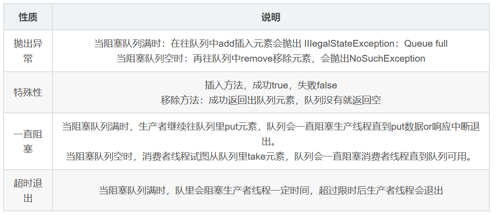

## **Synchronized和Lock有什么区别**

1. synchronized属于JVM层面，属于java的关键字 
   1. monitorenter（底层是通过monitor对象来完成，其实wait/notify等方法也依赖于monitor对象 只能在同步块或者方法中才能调用 wait/ notify等方法）
   2. Lock是具体类（java.util.concurrent.locks.Lock）是api层面的锁 
2. 使用方法：
   1. synchronized：不需要用户去手动释放锁，当synchronized代码执行后，系统会自动让线程释放对锁的占用。
   2. ReentrantLock：则需要用户去手动释放锁，若没有主动释放锁，就有可能出现死锁的现象，需要lock() 和 unlock() 配置try catch语句来完成 
3. 等待是否中断
   1. synchronized：不可中断，除非抛出异常或者正常运行完成。
   2. ReentrantLock：可中断，可以设置超时方法
      1. 设置超时方法，trylock(long timeout, TimeUnit unit)
      2. lockInterrupible() 放代码块中，调用interrupt() 方法可以中断  
4. 加锁是否公平 
   1. synchronized：非公平锁
   2. ReentrantLock：默认非公平锁，构造函数可以传递boolean值，true为公平锁，false为非公平锁 
5. 锁绑定多个条件Condition
   1. synchronized：没有，要么随机，要么全部唤醒
   2. ReentrantLock：用来实现分组唤醒需要唤醒的线程，可以精确唤醒，而不是像synchronized那样，要么随机，要么全部唤醒

## 线程池

### 线程池使用及优势

线程池做的工作主要是控制运行的线程的数量，处理过程中将任务放入队列，然后在线程创建后启动这些任务，如果线程数量超过了最大数量超出数量的线程排队等候，等其它线程执行完毕，再从队列中取出任务来执行。

它的主要特点为：线程复用，控制最大并发数，管理线程。

优点：

降低资源消耗。通过重复利用己创建的线程降低线程创建和销毁造成的消耗。
提高响应速度。当任务到达时，任务可以不需要的等到线程创建就能立即执行。
提高线程的可管理性。线程是稀缺资源，如果无限制的创建，不仅会消耗系统资源，还会降低系统的稳定性，使用线程池可以进行统一的分配，调优和监控。

### 线程池3个常用方式

Java中的线程池是通过Executor框架实现的，该框架中用到了Executor，Executors，ExecutorService，ThreadPoolExecutor这几个类。

- 了解

  实现有五种，Executors.newScheduledThreadPool()是带时间调度的，java8新推出Executors.newWorkStealingPool(int),使用目前机器上可用的处理器作为他的并行级别

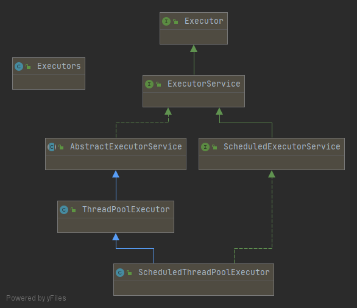

- Executors.newSingleThreadExecutor()

  ==**一个任务一个任务执行的场景**==

```java
public static ExecutorService newSingleThreadExecutor() {    return new FinalizableDelegatedExecutorService        (new ThreadPoolExecutor(1, 1,                                0L, TimeUnit.MILLISECONDS,                                new LinkedBlockingQueue<Runnable>()));}
```

1.创建一个单线程化的线程池，它只会用唯一的工作线程来执行任务，保证所有任务按照指定顺序执行。
2.newSingleThreadExecutor将corePoolSize和maximumPoolSize都设置为1，它使用的LinkedBlockingQueue。


-  Executors.newFixedThreadPool(int) 

  

  ==**执行长期的任务，性能好很多**==

```java
public static ExecutorService newFixedThreadPool(int nThreads) {        return new ThreadPoolExecutor(nThreads, nThreads,                                      0L, TimeUnit.MILLISECONDS,                                      new LinkedBlockingQueue<Runnable>());    }
```

- 创建一个定长线程池，可控制线程最大并发数，超出的线程会在队列中等待。
- newFixedThreadPool创建的线程池corePoolSize和maximumPoolSize值是相等的，它使用的LinkedBlockingQueue。

- Executors.newCachedThreadPool() 

==**执行很多短期异步的小程序或负载较轻的服务器**==

```java
public static ExecutorService newCachedThreadPool() {    return new ThreadPoolExecutor(0, Integer.MAX_VALUE,                                  60L, TimeUnit.SECONDS,                                  new SynchronousQueue<Runnable>());}
```

- 创建一个可缓存线程池，如果线程池长度超过处理需要，可灵活回收空闲线程，若无可回收，则新建线程。
- newCachedThreadPool将corePoolSize设置为0，将maximumPoolSize设置为Integer.MAX_VALUE，使用的SynchronousQueue，也就是说来了任务就创建线程运行，当线程空闲超过60秒，就销毁线程。

### 线程池的7个重要参数

```java
public ThreadPoolExecutor(int corePoolSize,                          int maximumPoolSize,                          long keepAliveTime,                          TimeUnit unit,                          BlockingQueue<Runnable> workQueue,                          ThreadFactory threadFactory,                          RejectedExecutionHandler handler)
```

1. **==corePoolSize==**：线程池中常驻核心线程数
   - 在创建了线程池后，当有请求任务来之后，就会安排池中的线程去执行请求任务
   - 当线程池的线程数达到corePoolSize后，就会把到达的任务放到缓存队列当中
2. **==maximumPoolSize==**：线程池能够容纳同时执行的最大线程数，必须大于等于1
3. **==keepAliveTime==**：多余的空闲线程的存活时间
   - 当前线程池数量超过corePoolSize时，档口空闲时间达到keepAliveTime值时，多余空闲线程会被销毁到只剩下corePoolSize个线程为止
4. **==unit==**：keepAliveTime的单位
5. **==workQueue==**：任务队列，被提交但尚未被执行的任务
6. **==threadFactory==**：表示生成线程池中工作线程的线程工厂，用于创建线程一般用默认的即可
7. **==handler==**：拒绝策略，表示当队列满了并且工作线程大于等于线程池的最大线程数（maximumPoolSize）时如何来拒绝请求执行的runable的策略

### 线程池工作原理

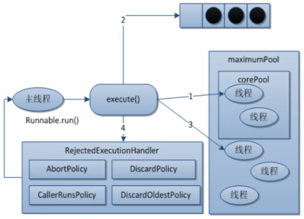

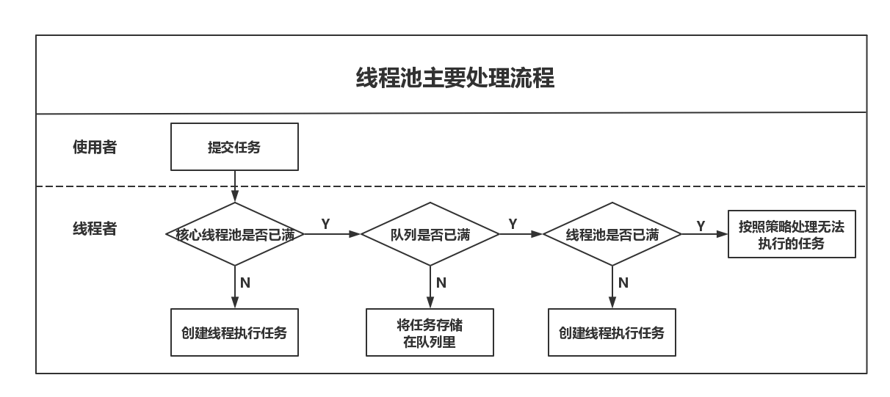

**==流程==**

1. 在创建了线程池之后，等待提交过来的 人物请求。

2. 当调用execute()方法添加一个请求任务时，线程池会做出如下判断

   2.1 如果正在运行的线程数量小于corePoolSize，那么马上船舰线程运行这个任务；

   2.2 如果正在运行的线程数量大于或等于corePoolSize，那么将这个任务放入队列；

   2.3如果此时队列满了且运行的线程数小于maximumPoolSize，那么还是要创建非核心线程立刻运行此任务

   2.4如果队列满了且正在运行的线程数量大于或等于maxmumPoolSize，那么启动饱和拒绝策略来执行

3. 当一个线程完成任务时，他会从队列中却下一个任务来执行

4. 当一个线程无事可做超过一定的时间（keepAliveTime）时，线程池会判断：

   如果当前运行的线程数大于corePoolSize，那么这个线程会被停掉；所以线程池的所有任务完成后他最大会收缩到corePoolSize的大小

### 线程池的拒绝策略

等待队列也已经排满了，再也塞不下新任务了同时，线程池中的max线程也达到了，无法继续为新任务服务。

这时候我们就需要拒绝策略机制合理的处理这个问题。

JDK拒绝策略：

- AbortPolicy（默认）：直接抛出 RejectedExecutionException异常阻止系统正常运知。
- CallerRunsPolicy："调用者运行"一种调节机制，该策略既不会抛弃任务，也不会抛出异常，而是将某些任务回退到调用者，从而降低新任务的流量。
- DiscardOldestPolicy：抛弃队列中等待最久的任务，然后把当前任务加入队列中尝试再次提交当前任务。
- DiscardPolicy：直接丢弃任务，不予任何处理也不抛出异常。如果允许任务丢失，这是最好的一种方案。
  以上内置拒绝策略均实现了RejectedExecutionHandler接口。

### 你在工作中单一的/固定数的/可变的三种创建线程池的方法，用哪个多

**==一个都不用，我们生产上只能使用自定义的！！！！==**

为什么？

线程池不允许使用Executors创建，试试通过ThreadPoolExecutor的方式，规避资源耗尽风险

FixedThreadPool和SingleThreadPool允许请求队列长度为Integer.MAX_VALUE，可能会堆积大量请求；；CachedThreadPool和ScheduledThreadPool允许的创建线程数量为Integer.MAX_VALUE，可能会创建大量线程，导致OOM

自定义线程池：

```java
package com.jian8.juc.thread;import java.util.concurrent.*;/** * 第四种获得java多线程的方式--线程池 */public class MyThreadPoolDemo {      public static void main(String[] args) {        ExecutorService threadPool = new ThreadPoolExecutor(3, 5, 1L,                							TimeUnit.SECONDS,                							new LinkedBlockingDeque<>(3),                                            Executors.defaultThreadFactory(),                                             new ThreadPoolExecutor.DiscardPolicy());//new ThreadPoolExecutor.AbortPolicy();//new ThreadPoolExecutor.CallerRunsPolicy();//new ThreadPoolExecutor.DiscardOldestPolicy();//new ThreadPoolExecutor.DiscardPolicy();        try {            for (int i = 1; i <= 10; i++) {                threadPool.execute(() -> {                    System.out.println(Thread.currentThread().getName() + "\t办理业务");                });            }        } catch (Exception e) {            e.printStackTrace();        } finally {            threadPool.shutdown();        }    }}
```

### 合理配置线程池你是如何考虑的？

1. **CPU密集型**

   CPU密集的意思是该任务需要大量的运算，而没有阻塞，CPU一直全速运行

   CPU密集任务只有在真正多核CPU上才可能得到加速（通过多线程）

   而在单核CPU上，无论你开几个模拟的多线程该任务都不可能得到加速，因为CPU总的运算能力就那些

   CPU密集型任务配置尽可能少的线程数量：

   ==**一般公式：CPU核数+1个线程的线程池**==

2. **IO密集型**

   - 由于IO密集型任务线程并不是一直在执行任务，则应配置经可能多的线程，如CPU核数 * 2

   - IO密集型，即该任务需要大量的IO，即大量的阻塞。

     在单线程上运行IO密集型的任务会导致浪费大量的 CPU运算能力浪费在等待。

     所以在IO密集型任务中使用多线程可以大大的加速程序运行，即使在单核CPU上，这种加速主要就是利用了被浪费掉的阻塞时间。

     IO密集型时，大部分线程都阻塞，故需要多配置线程数：

     参考公式：==CPU核数/（1-阻塞系数） 阻塞系数在0.8~0.9之间==

     八核CPU：8/（1-0，9）=80


## JVM垃圾回收的时候如何确定垃圾？是否知道什么是GC Roots

1. 什么是垃圾？

   内存中已经不再使用到的空间就是垃圾

2. 要进行垃圾回收，如何判断一个对象是否可以被回收

   - **引用计数法**：java中，引用和对象是由关联的。如果要操作对象则必须用引用进行。

     因此很显然一个简单的办法是通过引用计数来判断一个对象是否可以回收，简单说，给对象中添加一个引用计数器，每当有一个地方引用它，计数器加1，每当有一个引用失效时，计数器减1，任何时刻计数器数值为零的对象就是不可能再被使用的，那么这个对象就是可回收对象。

     但是它很难解决对象之间相互循环引用的问题

     JVM一般不采用这种实现方式。

   - **==枚举根节点做可达性分析（跟搜索路径）==**：

     为了解决引用计数法的循环引用问题，java使用了可达性分析的方法。

     所谓**GC ROOT**或者说**Tracing GC**的“根集合”就是一组比较活跃的引用。

     基本思路就是通过一系列“GC Roots”的对象作为起始点，从这个被称为GC Roots 的对象开始向下搜索，如果一个对象到GC Roots没有任何引用链相连时，则说明此对象不可用。也即**给定一个集合的引用作为根出发**，通过引用关系遍历对象图，能被便利到的对象就被判定为存活；没有被便利到的就被判定为死亡

#### 哪些对象可以作为GC Roots对象

- 虚拟机栈（栈帧中的局部变量区，也叫局部变量表）中应用的对象。
- 本地方法栈中JNI（native方法）引用的对象
- 方法区中的类静态属性引用的对象
- 方法区中常量引用的对象


## JAVA中的引用

### 强引用Reference

Reference类以及继承派生的类

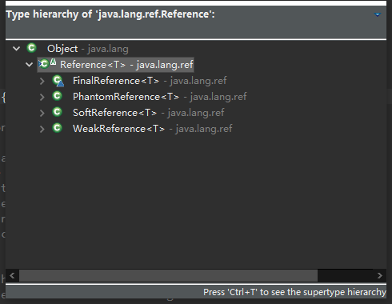

当内存不足，JVM开始垃圾回收，对于强引用的对象，就算是出现了OOM也不会对该对象进行回收，死都不收。

```java
// 这样定义的默认就是强应用Object obj1 = new Object();
```

**强引用是我们最常见的普通对象引用，只要还有强引用指向一个对象，就能表明对象还“活着”，垃圾收集器不会碰这种对象**。在Java中最常见的就是强引用，把一个对象赋给一个引用变量，这个引用变量就是一个强引用。当一个对象被强引用变量引用时，它处于可达状态，它是不可能被垃圾回收机制回收的，即使该对象以后永远都不会被用到JVM也不会回收。因此强引用是造成Java内存泄漏的主要原因之一。

对于一个普通的对象，如果没有其他的引用关系，只要超过了引用的作用域或者显式地将相应（强）引用赋值为 null一般认为就是可以被垃圾收集的了(当然具体回收时机还是要看垃圾收集策略)。

### 软引用SoftReference

软引用是一种相对强引用弱化了一些的引用，需要用java.lang.ref.SoftReference类来实现，可以让对象豁免一些垃圾收集。

对于只有软引用的对象来说，

- 当系统内存充足时它不会被回收，
- 当系统内存不足时它会被回收。
  软引用通常用在对内存敏感的程序中，比如高速缓存就有用到软引用，内存够用的时候就保留，不够用就回收!

当内存充足的时候，软引用不用回收：

```java
public class SoftReferenceDemo {    /**     * 内存够用的时候     * -XX:+PrintGCDetails     */    public static void softRefMemoryEnough() {        // 创建一个强应用        Object o1 = new Object();        // 创建一个软引用        SoftReference<Object> softReference = new SoftReference<>(o1);        System.out.println(o1);        System.out.println(softReference.get());        o1 = null;        // 手动GC        System.gc();        System.out.println(o1);        System.out.println(softReference.get());    }    /**     * JVM配置，故意产生大对象并配置小的内存，让它的内存不够用了导致OOM，看软引用的回收情况     * -Xms5m -Xmx5m -XX:+PrintGCDetails     */    public static void softRefMemoryNoEnough() {        System.out.println("========================");        // 创建一个强应用        Object o1 = new Object();        // 创建一个软引用        SoftReference<Object> softReference = new SoftReference<>(o1);        System.out.println(o1);        System.out.println(softReference.get());        o1 = null;        // 模拟OOM自动GC        try {            // 创建30M的大对象            byte[] bytes = new byte[30 * 1024 * 1024];        } catch (Exception e) {            e.printStackTrace();        } finally {            System.out.println(o1);            System.out.println(softReference.get());        }    }    public static void main(String[] args) {        softRefMemoryEnough();        //softRefMemoryNoEnough();    }}
```

### 弱引用WeakReference

弱引用需要用java.lang.ref.WeakReference类来实现，它比软引用的生存期更短，

对于只有弱引用的对象来说，**只要垃圾回收机制**一运行不管JVM的内存空间是否足够，都会回收该对象占用的内存

```java
import java.lang.ref.WeakReference;public class WeakReferenceDemo {    public static void main(String[] args) {        Object o1 = new Object();        WeakReference<Object> weakReference = new WeakReference<>(o1);        System.out.println(o1);        System.out.println(weakReference.get());        o1 = null;        System.gc();        System.out.println(o1);        System.out.println(weakReference.get());    }}
```

输出结果：

```java
java.lang.Object@15db9742java.lang.Object@15db9742nullnull
```

### 软引用和弱引用的适用场景

场景：假如有一个应用需要读取大量的本地图片

如果每次读取图片都从硬盘读取则会严重影响性能
如果一次性全部加载到内存中，又可能造成内存溢出
此时使用软引用可以解决这个问题。

设计思路：使用HashMap来保存图片的路径和相应图片对象关联的软引用之间的映射关系，在内存不足时，JVM会自动回收这些缓存图片对象所占的空间，从而有效地避免了OOM的问题

```java
Map<String, SoftReference<Bitmap>> imageCache = new HashMap<String, SoftReference<Bitmap>>();
```

### WeakHashMap案例演示和解析

> Hash table based implementation of the Map interface, with weak keys. An entry in a WeakHashMap will automatically be removed when its key is no longer in ordinary use. More precisely, the presence of a mapping for a given key will not prevent the key from being discarded by the garbage collector, that is, made finalizable, finalized, and then reclaimed. When a key has been discarded its entry is effectively removed from the map, so this class behaves somewhat differently from other Map implementations.

```java
import java.util.HashMap;import java.util.Map;import java.util.WeakHashMap;public class WeakHashMapDemo {    public static void main(String[] args) {        myHashMap();        System.out.println("==========");        myWeakHashMap();    }    private static void myHashMap() {        Map<Integer, String> map = new HashMap<>();        Integer key = new Integer(1);        String value = "HashMap";        map.put(key, value);        System.out.println(map);        key = null;        System.gc();        System.out.println(map);    }    private static void myWeakHashMap() {        Map<Integer, String> map = new WeakHashMap<>();        Integer key = new Integer(1);        String value = "WeakHashMap";        map.put(key, value);        System.out.println(map);        key = null;        System.gc();        System.out.println(map);    }}
```

输出结果：

```java
{1=HashMap}{1=HashMap}=========={1=WeakHashMap}{}
```

### 虚引用PhantomReference

虚引用需要java.lang.ref.PhantomReference类来实现。

顾名思义，就是形同虚设，与其他几种引用都不同，虚引用并不会决定对象的生命周期。

如果一个对象仅持有虚引用，那么它就和没有任何引用一样，在任何时候都可能被垃圾回收器回收，它不能单独使用也不能通过它访问对象，虚引用必须和引用队列(ReferenceQueue)联合使用。

虚引用的主要作用是跟踪对象被垃圾回收的状态。仅仅是提供了一种确保对象被finalize以后，做某些事情的机制。

PhantomReference的gei方法总是返回null，因此无法访问对应的引用对象。其意义在于说明一个对象已经进入finalization阶段，可以被gc回收，用来实现比fihalization机制更灵活的回收操作。

换句话说，设置虚引用关联的唯一目的，就是在这个对象被收集器回收的时候收到一个系统通知或者后续添加进一步的处理。Java技术允许使用finalize()方法在垃圾收集器将对象从内存中清除出去之前做必要的清理工作。

#### ReferenceQueue引用队列介

> Reference queues, to which registered reference objects are appended by the garbage collector after the appropriate reachability changes are detected.

```java
import java.lang.ref.ReferenceQueue;import java.lang.ref.WeakReference;import java.util.concurrent.TimeUnit;public class ReferenceQueueDemo {    public static void main(String[] args) {        Object o1 = new Object();        // 创建引用队列        ReferenceQueue<Object> referenceQueue = new ReferenceQueue<>();        // 创建一个弱引用        WeakReference<Object> weakReference = new WeakReference<>(o1, referenceQueue);        System.out.println(o1);        System.out.println(weakReference.get());        // 取队列中的内容        System.out.println(referenceQueue.poll());        System.out.println("==================");                o1 = null;        System.gc();        System.out.println("执行GC操作");        try {            TimeUnit.SECONDS.sleep(2);        } catch (InterruptedException e) {            e.printStackTrace();        }        System.out.println(o1);        System.out.println(weakReference.get());        // 取队列中的内容        System.out.println(referenceQueue.poll());    }}
```

输出结果：

```
java.lang.Object@15db9742java.lang.Object@15db9742null==================执行GC操作nullnulljava.lang.ref.WeakReference@6d06d69c
```

Java提供了4种引用类型，在垃圾回收的时候，都有自己各自的特点。

ReferenceQueue是用来配合引用工作的，没有ReferenceQueue一样可以运行。

创建引用的时候可以指定关联的队列，当Gc释放对象内存的时候，会将引用加入到引用队列，如果程序发现某个虚引用已经被加入到引用队列，那么就可以在所引用的对象的内存被回收之前采取必要的行动这相当于是一种通知机制。

当关联的引用队列中有数据的时候，意味着引用指向的堆内存中的对象被回收。通过这种方式，JVW允许我们在对象被销毁后，做一些我们自己想做的事情。

```java
import java.lang.ref.PhantomReference;import java.lang.ref.ReferenceQueue;public class PhantomReferenceDemo {	public static void main(String[] args) throws InterruptedException {		Object o1 = new Object();		ReferenceQueue<Object> referenceQueue = new ReferenceQueue<>();		PhantomReference<Object> phantomReference = new PhantomReference<>(o1, referenceQueue);		System.out.println(o1);		System.out.println(phantomReference.get());		System.out.println(referenceQueue.poll());				System.out.println("==================");		o1 = null;		System.gc();		Thread.sleep(500) ;				System.out.println(o1);		System.out.println(phantomReference.get());		System.out.println(referenceQueue.poll());	}}
```

输出结果：

```
java.lang.Object@15db9742nullnull==================nullnulljava.lang.ref.PhantomReference@6d06d69c
```

## GCRoots和四大引用小总结

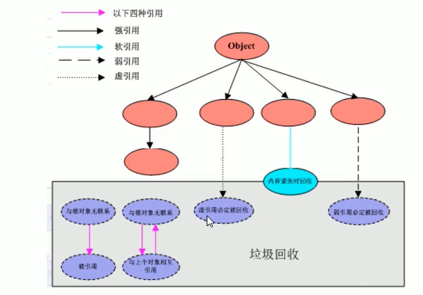

## StackOverflowError

JVM中常见的两种错误

- StackoverFlowError
  - java.lang.StackOverflowErro

- OutofMemoryError
  - java.lang.OutOfMemoryError：java heap space
  - java.lang.OutOfMemoryError：GC overhead limit exceeeded
  - java.lang.OutOfMemoryError：Direct buffer memory
  - java.lang.OutOfMemoryError：unable to create new native thread
  - java.lang.OutOfMemoryError：Metaspace

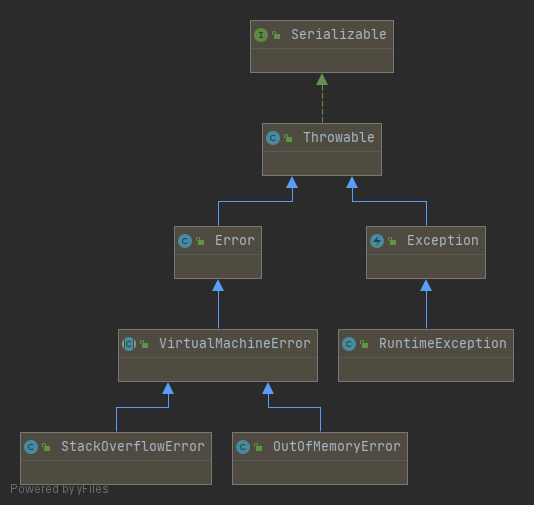

StackOverflowError的展现

```java
public class StackOverflowErrorDemo {	public static void main(String[] args) {		main(args);	}}
```

输出结果：

```java
Exception in thread "main" java.lang.StackOverflowError	at com.lun.jvm.StackOverflowErrorDemo.main(StackOverflowErrorDemo.java:6)	at com.lun.jvm.StackOverflowErrorDemo.main(StackOverflowErrorDemo.java:6)	at com.lun.jvm.StackOverflowErrorDemo.main(StackOverflowErrorDemo.java:6)    ...
```

## OutOfMemoryError

### OOM之Java heap space

```java
public class OOMEJavaHeapSpaceDemo {	/**	 * 	 * -Xms10m -Xmx10m	 * 	 * @param args	 */	public static void main(String[] args) {		byte[] array = new byte[80 * 1024 * 1024];	}}
```

输出结果：

```java
Exception in thread "main" java.lang.OutOfMemoryError: Java heap space	at com.lun.jvm.OOMEJavaHeapSpaceDemo.main(OOMEJavaHeapSpaceDemo.java:6)
```

### OOM之GC overhead limit exceeded

GC回收时间过长时会抛出OutOfMemroyError。过长的定义是，超过98%的时间用来做GC并且回收了不到2%的堆内存，连续多次GC 都只回收了不到2%的极端情况下才会抛出。

假如不抛出GC overhead limit错误会发生什么情况呢？那就是GC清理的这么点内存很快会再次填满，迫使cc再次执行。这样就形成恶性循环，CPU使用率一直是100%，而Gc却没有任何成果。


```java
import java.util.ArrayList;import java.util.List;public class OOMEGCOverheadLimitExceededDemo {    /**     *      * -Xms10m -Xmx10m -XX:MaxDirectMemorySize=5m     *      * @param args     */    public static void main(String[] args) {        int i = 0;        List<String> list = new ArrayList<>();        try {            while(true) {                //String.intern()是一个Native(本地)方法，它的作用是如果字符串常量池已经包含一个等于此String对象的字符串，则返回字符串常量池中这个字符串的引用, 否则将当前String对象的引用地址（堆中）添加到字符串常量池中并返回。                list.add(String.valueOf(++i).intern());            }        } catch (Exception e) {            System.out.println("***************i:" + i);            e.printStackTrace();            throw e;        }    }}
```

输出结果：

```java
[GC (Allocation Failure) [PSYoungGen: 2048K->498K(2560K)] 2048K->1658K(9728K), 0.0033090 secs] [Times: user=0.00 sys=0.00, real=0.00 secs] [GC (Allocation Failure) [PSYoungGen: 2323K->489K(2560K)] 3483K->3305K(9728K), 0.0020911 secs] [Times: user=0.00 sys=0.00, real=0.00 secs] [GC (Allocation Failure) [PSYoungGen: 2537K->496K(2560K)] 5353K->4864K(9728K), 0.0025591 secs] [Times: user=0.00 sys=0.00, real=0.00 secs] [GC (Allocation Failure) [PSYoungGen: 2410K->512K(2560K)] 6779K->6872K(9728K), 0.0058689 secs] [Times: user=0.09 sys=0.00, real=0.01 secs] [Full GC (Ergonomics) [PSYoungGen: 512K->0K(2560K)] [ParOldGen: 6360K->6694K(7168K)] 6872K->6694K(9728K), [Metaspace: 2651K->2651K(1056768K)], 0.0894928 secs] [Times: user=0.42 sys=0.00, real=0.09 secs] [Full GC (Ergonomics) [PSYoungGen: 2048K->1421K(2560K)] [ParOldGen: 6694K->6902K(7168K)] 8742K->8324K(9728K), [Metaspace: 2651K->2651K(1056768K)], 0.0514932 secs] [Times: user=0.34 sys=0.00, real=0.05 secs] [Full GC (Ergonomics) [PSYoungGen: 2048K->2047K(2560K)] [ParOldGen: 6902K->6902K(7168K)] 8950K->8950K(9728K), [Metaspace: 2651K->2651K(1056768K)], 0.0381615 secs] [Times: user=0.13 sys=0.00, real=0.04 secs] ...省略89行...[Full GC (Ergonomics) [PSYoungGen: 2047K->2047K(2560K)] [ParOldGen: 7044K->7044K(7168K)] 9092K->9092K(9728K), [Metaspace: 2651K->2651K(1056768K)], 0.0360935 secs] [Times: user=0.25 sys=0.00, real=0.04 secs] [Full GC (Ergonomics) [PSYoungGen: 2047K->2047K(2560K)] [ParOldGen: 7046K->7046K(7168K)] 9094K->9094K(9728K), [Metaspace: 2651K->2651K(1056768K)], 0.0360458 secs] [Times: user=0.38 sys=0.00, real=0.04 secs] [Full GC (Ergonomics) [PSYoungGen: 2047K->2047K(2560K)] [ParOldGen: 7048K->7048K(7168K)] 9096K->9096K(9728K), [Metaspace: 2651K->2651K(1056768K)], 0.0353033 secs] [Times: user=0.11 sys=0.00, real=0.04 secs] ***************i:147041[Full GC (Ergonomics) [PSYoungGen: 2047K->2047K(2560K)] [ParOldGen: 7050K->7048K(7168K)] 9098K->9096K(9728K), [Metaspace: 2670K->2670K(1056768K)], 0.0371397 secs] [Times: user=0.22 sys=0.00, real=0.04 secs] java.lang.OutOfMemoryError: GC overhead limit exceeded[Full GC (Ergonomics) 	at java.lang.Integer.toString(Integer.java:401)[PSYoungGen: 2047K->2047K(2560K)] [ParOldGen: 7051K->7050K(7168K)] 9099K->9097K(9728K), [Metaspace: 2676K->2676K(1056768K)], 0.0434184 secs] [Times: user=0.38 sys=0.00, real=0.04 secs] 	at java.lang.String.valueOf(String.java:3099)	at com.lun.jvm.OOMEGCOverheadLimitExceededDemo.main(OOMEGCOverheadLimitExceededDemo.java:19)Exception in thread "main" java.lang.OutOfMemoryError: GC overhead limit exceeded[Full GC (Ergonomics) [PSYoungGen: 2047K->0K(2560K)] [ParOldGen: 7054K->513K(7168K)] 9102K->513K(9728K), [Metaspace: 2677K->2677K(1056768K)], 0.0056578 secs] [Times: user=0.11 sys=0.00, real=0.01 secs] 	at java.lang.Integer.toString(Integer.java:401)	at java.lang.String.valueOf(String.java:3099)	at com.lun.jvm.OOMEGCOverheadLimitExceededDemo.main(OOMEGCOverheadLimitExceededDemo.java:19)Heap PSYoungGen      total 2560K, used 46K [0x00000000ffd00000, 0x0000000100000000, 0x0000000100000000)  eden space 2048K, 2% used [0x00000000ffd00000,0x00000000ffd0bb90,0x00000000fff00000)  from space 512K, 0% used [0x00000000fff80000,0x00000000fff80000,0x0000000100000000)  to   space 512K, 0% used [0x00000000fff00000,0x00000000fff00000,0x00000000fff80000) ParOldGen       total 7168K, used 513K [0x00000000ff600000, 0x00000000ffd00000, 0x00000000ffd00000)  object space 7168K, 7% used [0x00000000ff600000,0x00000000ff6807f0,0x00000000ffd00000) Metaspace       used 2683K, capacity 4486K, committed 4864K, reserved 1056768K  class space    used 285K, capacity 386K, committed 512K, reserved 1048576K
```

### OOM之Direct buffer memory

导致原因：

写NIO程序经常使用ByteBuffer来读取或者写入数据，这是一种基于通道(Channel)与缓冲区(Buffer)的IO方式，它可以使用Native函数库直接分配堆外内存，然后通过一个存储在Java堆里面的DirectByteBuffer对象作为这块内存的引用进行操作。这样能在一些场景中显著提高性能，因为避兔了在Java堆和Native堆中来回复制数据。

ByteBuffer.allocate(capability) 第一种方式是分配VM堆内存，属于GC管辖范围，由于需要拷贝所以速度相对较慢。
ByteBuffer.allocateDirect(capability) 第二种方式是分配OS本地内存，不属于GC管辖范围，由于不需要内存拷贝所以速度相对较快。
但如果不断分配本地内存，堆内存很少使用，那么JV就不需要执行GC，DirectByteBuffer对象们就不会被回收，这时候堆内存充足，但本地内存可能已经使用光了，再次尝试分配本地内存就会出现OutOfMemoryError，那程序就直接崩溃了。

```java
import java.nio.ByteBuffer;import java.util.concurrent.TimeUnit;public class OOMEDirectBufferMemoryDemo {	/**	 * -Xms5m -Xmx5m -XX:+PrintGCDetails -XX:MaxDirectMemorySize=5m	 * 	 * @param args	 * @throws InterruptedException	 */	public static void main(String[] args) throws InterruptedException {		System.out.println(String.format("配置的maxDirectMemory: %.2f MB",// 				sun.misc.VM.maxDirectMemory() / 1024.0 / 1024));				TimeUnit.SECONDS.sleep(3);				ByteBuffer bb = ByteBuffer.allocateDirect(6 * 1024 * 1024);	}	}
```

输出结果：

```java
[GC (Allocation Failure) [PSYoungGen: 1024K->504K(1536K)] 1024K->772K(5632K), 0.0014568 secs] [Times: user=0.09 sys=0.00, real=0.00 secs] 配置的maxDirectMemory: 5.00 MB[GC (System.gc()) [PSYoungGen: 622K->504K(1536K)] 890K->820K(5632K), 0.0009753 secs] [Times: user=0.00 sys=0.00, real=0.00 secs] [Full GC (System.gc()) [PSYoungGen: 504K->0K(1536K)] [ParOldGen: 316K->725K(4096K)] 820K->725K(5632K), [Metaspace: 3477K->3477K(1056768K)], 0.0072268 secs] [Times: user=0.00 sys=0.00, real=0.01 secs] Exception in thread "main" Heap PSYoungGen      total 1536K, used 40K [0x00000000ffe00000, 0x0000000100000000, 0x0000000100000000)  eden space 1024K, 4% used [0x00000000ffe00000,0x00000000ffe0a3e0,0x00000000fff00000)  from space 512K, 0% used [0x00000000fff80000,0x00000000fff80000,0x0000000100000000)  to   space 512K, 0% used [0x00000000fff00000,0x00000000fff00000,0x00000000fff80000) ParOldGen       total 4096K, used 725K [0x00000000ffa00000, 0x00000000ffe00000, 0x00000000ffe00000)  object space 4096K, 17% used [0x00000000ffa00000,0x00000000ffab5660,0x00000000ffe00000) Metaspace       used 3508K, capacity 4566K, committed 4864K, reserved 1056768K  class space    used 391K, capacity 394K, committed 512K, reserved 1048576Kjava.lang.OutOfMemoryError: Direct buffer memory	at java.nio.Bits.reserveMemory(Bits.java:694)	at java.nio.DirectByteBuffer.<init>(DirectByteBuffer.java:123)	at java.nio.ByteBuffer.allocateDirect(ByteBuffer.java:311)	at com.lun.jvm.OOMEDirectBufferMemoryDemo.main(OOMEDirectBufferMemoryDemo.java:20)
```

### OOM之unable to create new native thread故障演示

不能够创建更多的新的线程了，也就是说创建线程的上限达到了

高并发请求服务器时，经常会出现异常java.lang.OutOfMemoryError:unable to create new native thread，准确说该native thread异常与对应的平台有关

导致原因：

应用创建了太多线程，一个应用进程创建多个线程，超过系统承载极限
服务器并不允许你的应用程序创建这么多线程，linux系统默认运行单个进程可以创建的线程为1024个，如果应用创建超过这个数量，就会报 java.lang.OutOfMemoryError:unable to create new native thread
解决方法：

想办法降低你应用程序创建线程的数量，分析应用是否真的需要创建这么多线程，如果不是，改代码将线程数降到最低
对于有的应用，确实需要创建很多线程，远超过linux系统默认1024个线程限制，可以通过修改Linux服务器配置，扩大linux默认限制

```java
public class OOMEUnableCreateNewThreadDemo {    public static void main(String[] args) {        for (int i = 0; ; i++) {            System.out.println("************** i = " + i);            new Thread(() -> {                try {                    TimeUnit.SECONDS.sleep(Integer.MAX_VALUE);                } catch (InterruptedException e) {                    e.printStackTrace();                }            }, String.valueOf(i)).start();        }    }}
```

上面程序在Linux OS（CentOS）运行，会出现下列的错误，线程数大概在900多个

```java
Exception in thread "main" java.lang.OutOfMemoryError: unable to cerate new native thread
```

### OOM之Metaspace

使用java -XX:+PrintFlagsInitial命令查看本机的初始化参数，-XX:MetaspaceSize为21810376B（大约20.8M）

Java 8及之后的版本使用Metaspace来替代永久代。

Metaspace是方法区在Hotspot 中的实现，它与持久代最大的区别在于：Metaspace并不在虚拟机内存中而是使用本地内存也即在Java8中, classe metadata(the virtual machines internal presentation of Java class)，被存储在叫做Metaspace native memory。

永久代（Java8后被原空向Metaspace取代了）存放了以下信息：

虚拟机加载的类信息
常量池
静态变量
即时编译后的代码
模拟Metaspace空间溢出，我们借助CGLib直接操作字节码运行时不断生成类往元空间灌，类占据的空间总是会超过Metaspace指定的空间大小的。

首先添加CGLib依赖

```xml
<!-- https://mvnrepository.com/artifact/cglib/cglib --><dependency>    <groupId>cglib</groupId>    <artifactId>cglib</artifactId>    <version>3.2.10</version></dependency>
```

```java
import java.lang.reflect.Method;import net.sf.cglib.proxy.Enhancer;import net.sf.cglib.proxy.MethodInterceptor;import net.sf.cglib.proxy.MethodProxy;public class OOMEMetaspaceDemo {    // 静态类    static class OOMObject {}    /**     * -XX:MetaspaceSize=10m -XX:MaxMetaspaceSize=10m     *      * @param args     */    public static void main(final String[] args) {        // 模拟计数多少次以后发生异常        int i =0;        try {            while (true) {                i++;                // 使用Spring的动态字节码技术                Enhancer enhancer = new Enhancer();                enhancer.setSuperclass(OOMObject.class);                enhancer.setUseCache(false);                enhancer.setCallback(new MethodInterceptor() {                    @Override                    public Object intercept(Object o, Method method, Object[] objects, MethodProxy methodProxy) throws Throwable {                        return methodProxy.invokeSuper(o, args);                    }                });                enhancer.create();            }        } catch (Throwable e) {            System.out.println("发生异常的次数:" + i);            e.printStackTrace();        } finally {        }    }}
```

输出结果

```java
发生异常的次数:569java.lang.OutOfMemoryError: Metaspace	at net.sf.cglib.core.AbstractClassGenerator.generate(AbstractClassGenerator.java:348)	at net.sf.cglib.proxy.Enhancer.generate(Enhancer.java:492)	at net.sf.cglib.core.AbstractClassGenerator$ClassLoaderData.get(AbstractClassGenerator.java:117)	at net.sf.cglib.core.AbstractClassGenerator.create(AbstractClassGenerator.java:294)	at net.sf.cglib.proxy.Enhancer.createHelper(Enhancer.java:480)	at net.sf.cglib.proxy.Enhancer.create(Enhancer.java:305)	at com.lun.jvm.OOMEMetaspaceDemo.main(OOMEMetaspaceDemo.java:37)
```

## 垃圾收集器回收种类

GC算法(引用计数/复制/标清/标整)是内存回收的方法论，垃圾收集器就是算法落地实现。

因为目前为止还没有完美的收集器出现，更加没有万能的收集器，只是针对具体应用最合适的收集器，进行分代收集

4种主要垃圾收集器

- Serial
- Parallel
- CMS
- G1

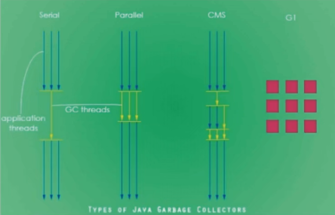

## 如何查看默认的垃圾收集器

```
java -XX:+PrintCommandLineFlags -version
```

输出结果

```java
C:\Users\abc>java -XX:+PrintCommandLineFlags -version-XX:InitialHeapSize=266613056 -XX:MaxHeapSize=4265808896 -XX:+PrintCommandLineFlags -XX:+UseCompressedClassPointers -XX:+UseCompressedOops -XX:-UseLargePagesIndividualAllocation -XX:+UseParallelGCjava version "1.8.0_251"Java(TM) SE Runtime Environment (build 1.8.0_251-b08)Java HotSpot(TM) 64-Bit Server VM (build 25.251-b08, mixed mode)
```


从结果看到-XX:+UseParallelGC，也就是说默认的垃圾收集器是并行垃圾回收器。

或者

```
jps -l1
```

得出Java程序号

```
jinfo -flags (Java程序号)
```

## JVM默认的垃圾收集器有哪些

Java中一共有7大垃圾收集器

年轻代GC

- UserSerialGC：串行垃圾收集器
- UserParallelGC：并行垃圾收集器
- UseParNewGC：年轻代的并行垃圾回收器

老年代GC

- UserSerialOldGC：串行老年代垃圾收集器（已经被移除）
- UseParallelOldGC：老年代的并行垃圾回收器
- UseConcMarkSweepGC：（CMS）并发标记清除

老嫩通吃

- UseG1GC：G1垃圾收集器

## GC之7大垃圾收集器概述

垃圾收集器就来具体实现这些GC算法并实现内存回收。

不同厂商、不同版本的虚拟机实现差别很大，HotSpot中包含的收集器如下图所示：

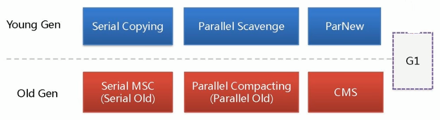

新生代

- 串行GC(Serial)/(Serial Copying)
- 并行GC(ParNew)
- 并行回收GC(Parallel)/(Parallel Scavenge)

## GC之约定参数说明

DefNew：Default New Generation
Tenured：Old
ParNew：Parallel New Generation
PSYoungGen：Parallel Scavenge
ParOldGen：Parallel Old Generation

#### Server/Client模式分别是什么意思？

使用范围：一般使用Server模式，Client模式基本不会使用

操作系统

32位的Window操作系统，不论硬件如何都默认使用Client的JVM模式
32位的其它操作系统，2G内存同时有2个cpu以上用Server模式，低于该配置还是Client模式
64位只有Server模式

## GC之Serial收集器

> serial
> 英 [ˈsɪəriəl] 美 [ˈsɪriəl]
> n. 电视连续剧;广播连续剧;杂志连载小说
> adj. 顺序排列的;排成系列的;连续的;多次的;以连续剧形式播出的;连载的

一句话：一个单线程的收集器，在进行垃圾收集时候，必须暂停其他所有的工作线程直到它收集结束。


STW: Stop The World

串行收集器是最古老，最稳定以及效率高的收集器，只使用一个线程去回收但其在进行垃圾收集过程中可能会产生较长的停顿（Stop-The-World”状态)。虽然在收集垃圾过程中需要暂停所有其他的工作线程，但是它简单高效，对于限定单个CPU环境来说，没有线程交互的开销可以获得最高的单线程垃圾收集效率，因此Serial垃圾收集器依然是java虚拟机运行在Client模式下默认的新生代垃圾收集器。

对应JVM参数是：-XX:+UseSerialGC

开启后会使用：Serial(Young区用) + Serial Old(Old区用)的收集器组合

表示：新生代、老年代都会使用串行回收收集器，新生代使用复制算法，老年代使用标记-整理算法

## GC之ParNew收集器

一句话：使用多线程进行垃圾回收，在垃圾收集时，会Stop-The-World暂停其他所有的工作线程直到它收集结束。


ParNew收集器其实就是Serial收集器新生代的并行多线程版本，最常见的应用场景是配合老年代的CMS GC工作，其余的行为和Seria收集器完全一样，ParNew垃圾收集器在垃圾收集过程中同样也要暂停所有其他的工作线程。它是很多Java虚拟机运行在Server模式下新生代的默认垃圾收集器。

常用对应JVM参数：-XX:+UseParNewGC启用ParNew收集器，只影响新生代的收集，不影响老年代。

开启上述参数后，会使用：ParNew(Young区)+ Serial Old的收集器组合，新生代使用复制算法，老年代采用标记-整理算法

但是，ParNew+Tenured这样的搭配，Java8已经不再被推荐

> Java HotSpot™64-Bit Server VM warning:
> Using the ParNew young collector with the Serial old collector is deprecated and will likely be removed in a future release.

## GC之Parallel收集器

Parallel / Parallel Scavenge


Parallel Scavenge收集器类似ParNew也是一个新生代垃圾收集器，使用复制算法，也是一个并行的多线程的垃圾收集器，俗称吞吐量优先收集器。一句话：串行收集器在新生代和老年代的并行化。

它重点关注的是：

可控制的吞吐量(Thoughput=运行用户代码时间(运行用户代码时间+垃圾收集时间),也即比如程序运行100分钟，垃圾收集时间1分钟，吞吐量就是99% )。高吞吐量意味着高效利用CPU的时间，它多用于在后台运算而不需要太多交互的任务。

自适应调节策略也是ParallelScavenge收集器与ParNew收集器的一个重要区别。(自适应调节策略:虚拟机会根据当前系统的运行情况收集性能监控信息，动态调整这些参数以提供最合适的停顿时间（-XX:MaxGCPauseMillis）或最大的吞吐量。

常用JVM参数：-XX:+UseParallelGC或-XX:+UseParallelOldGC（可互相激活）使用Parallel Scanvenge收集器。

开启该参数后：新生代使用复制算法，老年代使用标记-整理算法。

多说一句：-XX:ParallelGCThreads=数字N 表示启动多少个GC线程

cpu>8 N= 5/8

cpu<8 N=实际个数

## GC之ParallelOld收集器

Parallel Old收集器是Parallel Scavenge的老年代版本，使用多线程的标记-整理算法，Parallel Old收集器在JDK1.6才开始提供。

在JDK1.6之前，新生代使用ParallelScavenge收集器只能搭配年老代的Serial Old收集器，只能保证新生代的吞吐量优先，无法保证整体的吞吐量。在JDK1.6之前（Parallel Scavenge + Serial Old )

Parallel Old 正是为了在年老代同样提供吞吐量优先的垃圾收集器，如果系统对吞吐量要求比较高，JDK1.8后可以优先考虑新生代Parallel Scavenge和年老代Parallel Old收集器的搭配策略。在JDK1.8及后〈Parallel Scavenge + Parallel Old )

JVM常用参数：-XX:+UseParallelOldGC使用Parallel Old收集器，设置该参数后，新生代Parallel+老年代Parallel Old。

## GC之CMS收集器

CMS收集器(Concurrent Mark Sweep：并发标记清除）是一种以获取最短回收停顿时间为目标的收集器。

适合应用在互联网站或者B/S系统的服务器上，这类应用尤其重视服务器的响应速度，希望系统停顿时间最短。

CMS非常适合地内存大、CPU核数多的服务器端应用，也是G1出现之前大型应用的首选收集器。

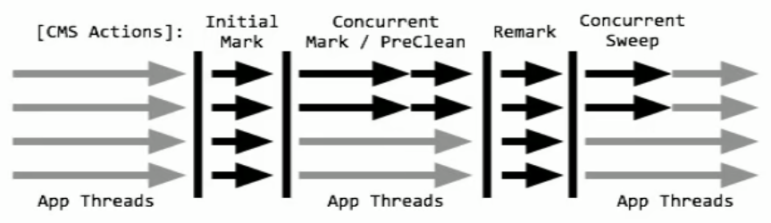

Concurrent Mark Sweep并发标记清除，并发收集低停顿,并发指的是与用户线程一起执行
开启该收集器的JVM参数：-XX:+UseConcMarkSweepGC开启该参数后会自动将-XX:+UseParNewGC打开。

开启该参数后，使用ParNew（Young区用）+ CMS（Old区用）+ Serial Old的收集器组合，Serial Old将作为CMS出错的后备收集器。

4步过程：

初始标记（CMS initial mark） - 只是标记一下GC Roots能直接关联的对象，速度很快，仍然需要暂停所有的工作线程。

并发标记（CMS concurrent mark）和用户线程一起 - 进行GC Roots跟踪的过程，和用户线程一起工作，不需要暂停工作线程。主要标记过程，标记全部对象。

重新标记（CMS remark）- 为了修正在并发标记期间，因用户程序继续运行而导致标记产生变动的那一部分对象的标记记录，仍然需要暂停所有的工作线程。由于并发标记时，用户线程依然运行，因此在正式清理前，再做修正。

并发清除（CMS concurrent sweep） - 清除GCRoots不可达对象，和用户线程一起工作，不需要暂停工作线程。基于标记结果，直接清理对象，由于耗时最长的并发标记和并发清除过程中，垃圾收集线程可以和用户现在一起并发工作，所以总体上来看CMS 收集器的内存回收和用户线程是一起并发地执行。

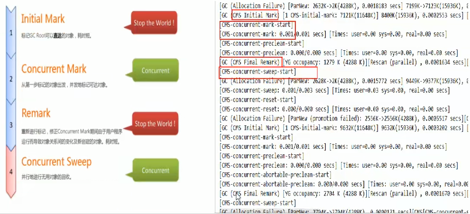

优点：并发收集低停顿。

缺点：并发执行，对CPU资源压力大，采用的标记清除算法会导致大量碎片。

由于并发进行，CMS在收集与应用线程会同时会增加对堆内存的占用，也就是说，CMS必须要在老年代堆内存用尽之前完成垃圾回收，否则CMS回收失败时，将触发担保机制，串行老年代收集器将会以STW的方式进行一次GC，从而造成较大停顿时间。

标记清除算法无法整理空间碎片，老年代空间会随着应用时长被逐步耗尽，最后将不得不通过担保机制对堆内存进行压缩。CMS也提供了参数-XX:CMSFullGCsBeForeCompaction(默认O，即每次都进行内存整理)来指定多少次CMS收集之后，进行一次压缩的Full GC。

## GC之G1收集器

以前收集器特点：

年轻代和老年代是各自独立且连续的内存块；
年轻代收集使用单eden+s0+s1进行复机算法；
老年代收集必须扫描整个老年代区域；
都是以尽可能少而快速地执行GC为设计原则。
**G1是什么**

G1 (Garbage-First）收集器，是一款面向服务端应用的收集器：
从官网的描述中，我们知道G1是一种服务器端的垃圾收集器，应用在多处理器和大容量内存环境中，在实现高吞吐量的同时，尽可能的满足垃圾收集暂停时间的要求。另外，它还具有以下特性:

像CMS收集器一样，能与应用程序线程并发执行。

整理空闲空间更快。

需要更多的时间来预测GC停顿时间。

不希望牺牲大量的吞吐性能。

不需要更大的Java Heap。

**G1收集器的设计目标是取代CMS收集器**，它同CMS相比，在以下方面表现的更出色：

G1是一个有整理内存过程的垃圾收集器，不会产生很多内存碎片。

G1的Stop The World(STW)更可控，G1在停顿时间上添加了预测机制，用户可以指定期望停顿时间。

CMS垃圾收集器虽然减少了暂停应用程序的运行时间，但是它还是存在着内存碎片问题。于是，为了去除内存碎片问题，同时又保留CMS垃圾收集器低暂停时间的优点，JAVA7发布了一个新的垃圾收集器-G1垃圾收集器。

G1是在2012年才在jdk1.7u4中可用。oracle官方计划在JDK9中将G1变成默认的垃圾收集器以替代CMS。它是一款面向服务端应用的收集器，主要应用在多CPU和大内存服务器环境下，极大的减少垃圾收集的停顿时间，全面提升服务器的性能，逐步替换java8以前的CMS收集器。

主要改变是Eden，Survivor和Tenured等内存区域不再是连续的了，而是变成了一个个大小一样的region ,每个region从1M到32M不等。一个region有可能属于Eden，Survivor或者Tenured内存区域。

特点：

- G1能充分利用多CPU、多核环境硬件优势，尽量缩短STW。
- G1整体上采用标记-整理算法，局部是通过复制算法，不会产生内存碎片。
- 宏观上看G1之中不再区分年轻代和老年代。把内存划分成多个独立的子区域(Region)，可以近似理解为一个围棋的棋盘。
- G1收集器里面讲整个的内存区都混合在一起了，但其本身依然在小范围内要进行年轻代和老年代的区分，保留了新生代和老年代，但它们不再是物理隔离的，而是一部分Region的集合且不需要Region是连续的，也就是说依然会采用不同的GC方式来处理不同的区域。
- G1虽然也是分代收集器，但整个内存分区不存在物理上的年轻代与老年代的区别，也不需要完全独立的survivor(to space)堆做复制准备。G1只有逻辑上的分代概念，或者说每个分区都可能随G1的运行在不同代之间前后切换。

### GC之G1底层原理

Region区域化垃圾收集器 - 最大好处是化整为零，避免全内存扫描，只需要按照区域来进行扫描即可。

区域化内存划片Region，整体编为了一些列不连续的内存区域，避免了全内存区的GC操作。

核心思想是将整个堆内存区域分成大小相同的子区域(Region)，在JVM启动时会自动设置这些子区域的大小，在堆的使用上，**G1并不要求对象的存储一定是物理上连续的只要逻辑上连续即可**，每个分区也不会固定地为某个代服务，可以按需在年轻代和老年代之间切换。启动时可以通过参数-XX:G1HeapRegionSize=n可指定分区大小（1MB~32MB，且必须是2的幂），默认将整堆划分为2048个分区。

大小范围在1MB~32MB，最多能设置2048个区域，也即能够支持的最大内存为：32 M B ∗ 2048 = 65536 M B = 64 G 32MB*2048=65536MB=64G32MB∗2048=65536MB=64G内存


> humongous
> 英 [hjuːˈmʌŋɡəs] 美 [hjuːˈmʌŋɡəs]
> adj. 巨大的;庞大的

G1算法将堆划分为若干个区域(Region），它仍然属于分代收集器。

这些Region的一部分包含**新生代**，新生代的垃圾收集依然采用暂停所有应用线程的方式，将存活对象拷贝到老年代或者Survivor空间。

这些Region的一部分包含**老年代**，G1收集器通过将对象从一个区域复制到另外一个区域，完成了清理工作。这就意味着，在正常的处理过程中，G1完成了堆的压缩（至少是部分堆的压缩），这样也就不会有CMS内存碎片问题的存在了。

在G1中，还有一种特殊的区域，叫Humongous区域。

如果一个对象占用的空间超过了分区容量50%以上，G1收集器就认为这是一个巨型对象。这些巨型对象默认直接会被分配在年老代，但是如果它是一个短期存在的巨型对象，就会对垃圾收集器造成负面影响。

为了解决这个问题，G1划分了一个Humongous区，它用来专门存放巨型对象。如果一个H区装不下一个巨型对象，那么G1会寻找连续的H分区来存储。为了能找到连续的H区，有时候不得不启动Full GC。

**回收步骤**

G1收集器下的Young GC

针对Eden区进行收集，Eden区耗尽后会被触发，主要是小区域收集＋形成连续的内存块，避免内存碎片

- Eden区的数据移动到Survivor区，假如出现Survivor区空间不够，Eden区数据会晋升到Old
- Survivor区的数据移动到新的Survivor区，部分数据晋升到Old区。
- 最后Eden区收拾干净了，GC结束，用户的应用程序继续执行。

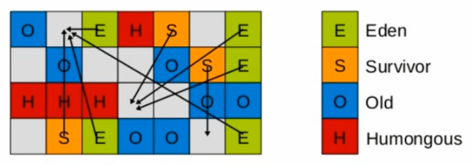


4步过程：

初始标记：只标记GC Roots能直接关联到的对象
并发标记：进行GC Roots Tracing的过程
最终标记：修正并发标记期间，因程序运行导致标记发生变化的那一部分对象
筛选回收：根据时间来进行价值最大化的回收

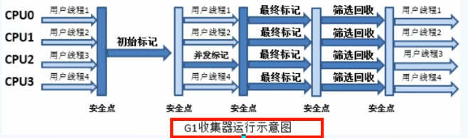

### G1参数配置及和CMS的比较

- -XX:+UseG1GC
- -XX:G1HeapRegionSize=n：设置的G1区域的大小。值是2的幂，范围是1MB到32MB。目标是根据最小的Java堆大小划分出约2048个区域。
- -XX:MaxGCPauseMillis=n：最大GC停顿时间，这是个软目标，JVM将尽可能（但不保证）停顿小于这个时间。
- -XX:InitiatingHeapOccupancyPercent=n：堆占用了多少的时候就触发GC，默认为45。
- -XX:ConcGCThreads=n：并发GC使用的线程数。
- -XX:G1ReservePercent=n：设置作为空闲空间的预留内存百分比，以降低目标空间溢出的风险，默认值是 10%。

开发人员仅仅需要声明以下参数即可：

三步归纳：开始G1+设置最大内存+设置最大停顿时间

- -XX:+UseG1GC
- -Xmx32g
- -XX:MaxGCPauseMillis=100
  -XX:MaxGCPauseMillis=n：最大GC停顿时间单位毫秒，这是个软目标，JVM将尽可能（但不保证）停顿小于这个时间

### JVMGC结合SpringBoot微服务优化简介

1. IDEA开发微服务工程。
2. Maven进行clean package。
3. 要求微服务启动的时候，同时配置我们的JVM/GC的调优参数。
4. 公式：`java -server jvm的各种参数 -jar 第1步上面的jar/war包名`。

## Linux命令之top

top - 整机性能查看

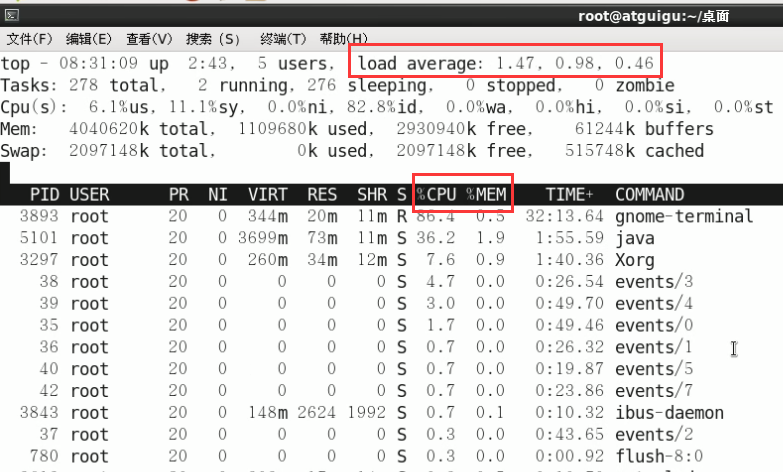

主要看load average, CPU, MEN三部分

> load average表示系统负载，即任务队列的平均长度。 三个数值分别为 1分钟、5分钟、15分钟前到现在的平均值。
>
> load average: 如果这个数除以逻辑CPU的数量，结果高于5的时候就表明系统在超负荷运转了。
>
> Linux中top命令参数详解

uptime - 系统性能命令的精简版

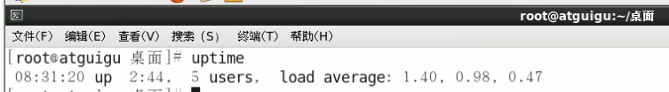

## Linux之cpu查看vmstat

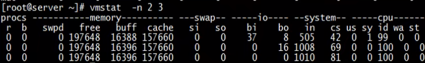

```
vmstat -n 2 3
```

- procs

  - r：运行和等待的CPU时间片的进程数，原则上1核的CPU的运行队列不要超过2，整个系统的运行队列不超过总核数的2倍，否则代表系统压力过大，我们看蘑菇博客测试服务器，能发现都超过了2，说明现在压力过大
  - b：等待资源的进程数，比如正在等待磁盘I/O、网络I/O等

- cpu

  us：用户进程消耗CPU时间百分比，us值高，用户进程消耗CPU时间多，如果长期大于50%，优化程序
  sy：内核进程消耗的CPU时间百分比
  us + sy 参考值为80%，如果us + sy 大于80%，说明可能存在CPU不足，从上面的图片可以看出，us + sy还没有超过百分80，因此说明蘑菇博客的CPU消耗不是很高
  id：处于空闲的CPU百分比
  wa：系统等待IO的CPU时间百分比
  st：来自于一个虚拟机偷取的CPU时间比

## Linux之cpu查看pidstat

查看看所有cpu核信息

```
mpstat -P ALL 2
```

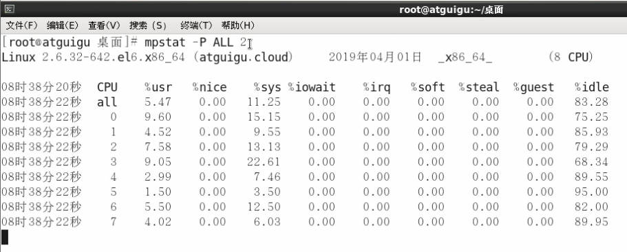

每个进程使用cpu的用量分解信息

```
pidstat -u 1 -p 进程编号
```

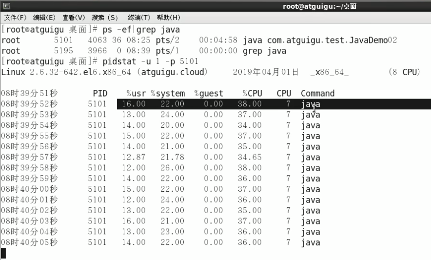

## Linux之内存查看free和pidstat

应用程序可用内存数

经验值

- 应用程序可用内存l系统物理内存>70%内存充足
- 应用程序可用内存/系统物理内存<20%内存不足，需要增加内存
- 20%<应用程序可用内存/系统物理内存<70%内存基本够用

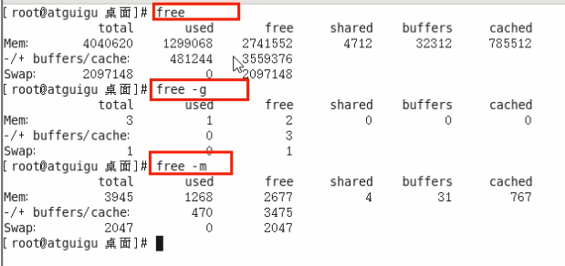

m/g：兆/吉

查看额外

```
pidstat -p 进程号 -r 采样间隔秒数
```

## Linux之硬盘查看df

```
df -h
```

-h: (human)以人类友好的形式展示

查看磁盘剩余空间数

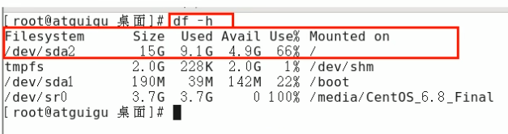

## Linux之磁盘IO查看iostat和pidstat

磁盘I/O性能评估

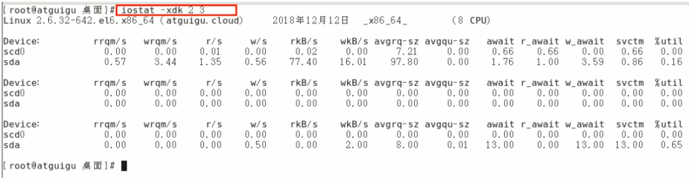

磁盘块设备分布

> rkB/s每秒读取数据量kB;wkB/s每秒写入数据量kB;
> svctm lO请求的平均服务时间，单位毫秒;
> await l/O请求的平均等待时间，单位毫秒;值越小，性能越好;
> util一秒中有百分几的时间用于I/O操作。接近100%时，表示磁盘带宽跑满，需要优化程序或者增加磁盘;
> rkB/s、wkB/s根据系统应用不同会有不同的值，但有规律遵循:长期、超大数据读写，肯定不正常，需要优化程序读取。
> svctm的值与await的值很接近，表示几乎没有IO等待，磁盘性能好。
> 如果await的值远高于svctm的值，则表示IO队列等待太长，需要优化程序或更换更快磁盘。

## Linux之网络IO查看ifstat

默认本地没有，下载ifstat

```shell
wget http://gael.roualland.free.fr/lifstat/ifstat-1.1.tar.gztar -xzvf ifstat-1.1.tar.gzcd ifstat-1.1./configuremakemake install
```

查看网络IO

各个网卡的in、out

观察网络负载情况程序

网络读写是否正常

- 程序网络I/O优化
- 增加网络I/O带宽

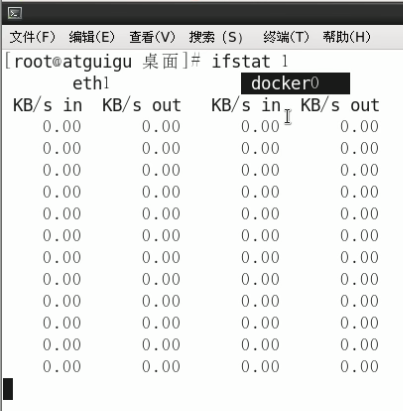

## CPU占用过高的定位分析思路

结合Linux和JDK命令一块分析

案例步骤

- 先用top命令找出CPU占比最高的

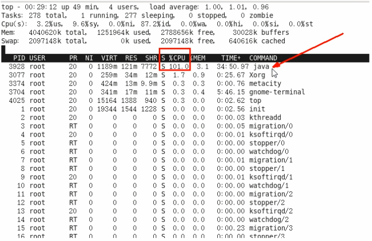

- ps -ef或者jps进一步定位，得知是一个怎么样的一个后台程序作搞屎棍

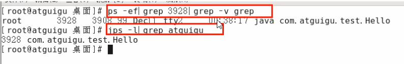

- 定位到具体线程或者代码

  ps -mp 进程 -o THREAD,tid,time
  -m 显示所有的线程
  -p pid进程使用cpu的时间
  -o 该参数后是用户自定义格式


- 将需要的线程ID转换为16进制格式（英文小写格式），命令printf %x 172 将172转换为十六进制
  jstack 进程ID | grep tid（16进制线程ID小写英文）-A60

  > ps - process status
  > -A Display information about other users’ processes, including those without controlling terminals.

-e Identical to -A.

-f Display the uid, pid, parent pid, recent CPU usage, process start time, controlling tty, elapsed CPU usage, and the associated command. If the -u option is also used, display the user name rather then the numeric uid. When -o or -O is used to add to the display following -f, the command field is not truncated as severely as it is in other formats.

[ps -ef中的e、f是什么含义](https://blog.csdn.net/lzufeng/article/details/83537275)

对于JDK自带的JVM监控和性能分析工具用过哪些?一般你是怎么用的?[link](https://blog.csdn.net/u011863024/article/details/106651068)

## LockSupport是什么

[LockSupport Java doc](https://docs.oracle.com/javase/8/docs/api/java/util/concurrent/locks/LockSupport.html)

LockSupport是用来创建锁和其他同步类的基本线程阻塞原语。

LockSupport中的park()和 unpark()的作用分别是阻塞线程和解除阻塞线程。

总之，比wait/notify，await/signal更强。

3种让线程等待和唤醒的方法

- 方式1：使用Object中的wait()方法让线程等待，使用object中的notify()方法唤醒线程
- 方式2：使用JUC包中Condition的await()方法让线程等待，使用signal()方法唤醒线程
- 方式3：LockSupport类可以阻塞当前线程以及唤醒指定被阻塞的线程

### wait\notify限制

Object类中的wait和notify方法实现线程等待和唤醒

```java
public class WaitNotifyDemo {

	static Object lock = new Object();
	
	public static void main(String[] args) {
		new Thread(()->{
			synchronized (lock) {
				System.out.println(Thread.currentThread().getName()+" come in.");
				try {
					lock.wait();
				} catch (Exception e) {
					e.printStackTrace();
				}
			}
			System.out.println(Thread.currentThread().getName()+" 唤醒.");
		}, "Thread A").start();
		
		new Thread(()->{
			synchronized (lock) {
				lock.notify();
				System.out.println(Thread.currentThread().getName()+" 通知.");
			}
		}, "Thread B").start();
	}
}
```

wait和notify方法必须要在同步块或者方法里面且成对出现使用，否则会抛出java.lang.IllegalMonitorStateException。

调用顺序要先wait后notify才OK。

### await\signal限制

Condition接口中的await后signal方法实现线程的等待和唤醒，与Object类中的wait和notify方法实现线程等待和唤醒类似。

```java
import java.util.concurrent.locks.Condition;
import java.util.concurrent.locks.ReentrantLock;

public class ConditionAwaitSignalDemo {
		
	public static void main(String[] args) {
		
		ReentrantLock lock = new ReentrantLock();
		Condition condition = lock.newCondition();
		
		new Thread(()->{
			
			try {
				System.out.println(Thread.currentThread().getName()+" come in.");
				lock.lock();
				condition.await();				
			} catch (InterruptedException e) {
				e.printStackTrace();
			} finally {
				lock.unlock();
			}
			
			System.out.println(Thread.currentThread().getName()+" 换醒.");
		},"Thread A").start();
		
		new Thread(()->{
			try {
				lock.lock();
				condition.signal();
				System.out.println(Thread.currentThread().getName()+" 通知.");
			}finally {
				lock.unlock();
			}
		},"Thread B").start();
	}
	
}
```

### LockSupport方法介绍

传统的synchronized和Lock实现等待唤醒通知的约束

- 线程先要获得并持有锁，必须在锁块(synchronized或lock)中
- 必须要先等待后唤醒，线程才能够被唤醒

LockSupport类中的park等待和unpark唤醒

>  Basic thread blocking primitives for creating locks and other synchronization classes.
>
> This class associates, with each thread that uses it, a permit (in the sense of the Semaphore class). A call to park will return immediately if the permit is available, consuming it in the process; otherwise it may block. A call to unpark makes the permit available, if it was not already available. (Unlike with Semaphores though, permits do not accumulate. There is at most one.) link

LockSupport是用来创建锁和其他同步类的基本线程阻塞原语。

LockSupport类使用了一种名为Permit（许可）的概念来做到阻塞和唤醒线程的功能，每个线程都有一个许可（permit），permit只有两个值1和零，默认是零。

可以把许可看成是一种(0.1)信号量（Semaphore），但与Semaphore不同的是，许可的累加上限是1。

**通过park()和unpark(thread)方法来实现阻塞和唤醒线程的操作**

park()/

park(Object blocker) - 阻塞当前线程阻塞传入的具体线程

```java
public class LockSupport {

    ...
    
    public static void park() {
        UNSAFE.park(false, 0L);
    }

    public static void park(Object blocker) {
        Thread t = Thread.currentThread();
        setBlocker(t, blocker);
        UNSAFE.park(false, 0L);
        setBlocker(t, null);
    }
    
    ...
    
}
```

permit默认是0，所以一开始调用park()方法，当前线程就会阻塞，直到别的线程将当前线程的permit设置为1时，park方法会被唤醒，然后会将permit再次设置为0并返回。

unpark(Thread thread) - 唤醒处于阻塞状态的指定线程

```java
public class LockSupport {
 
    ...
    
    public static void unpark(Thread thread) {
        if (thread != null)
            UNSAFE.unpark(thread);
    }
    
    ...

}
```

调用unpark(thread)方法后，就会将thread线程的许可permit设置成1（注意多次调用unpark方法，不会累加，pemit值还是1）会自动唤醒thead线程，即之前阻塞中的LockSupport.park()方法会立即返回。

### LockSupport案例解析

```java
public class LockSupportDemo {

	public static void main(String[] args) {
		Thread a = new Thread(()->{
//			try {
//				TimeUnit.SECONDS.sleep(2);
//			} catch (InterruptedException e) {
//				e.printStackTrace();
//			}
			System.out.println(Thread.currentThread().getName() + " come in. " + System.currentTimeMillis());
			LockSupport.park();
			System.out.println(Thread.currentThread().getName() + " 换醒. " + System.currentTimeMillis());
		}, "Thread A");
		a.start();
		
		Thread b = new Thread(()->{
			try {
				TimeUnit.SECONDS.sleep(1);
			} catch (InterruptedException e) {
				e.printStackTrace();
			}
			LockSupport.unpark(a);
			System.out.println(Thread.currentThread().getName()+" 通知.");
		}, "Thread B");
		b.start();
	}
	
}
```

输出结果：

```
Thread A come in.
Thread B 通知.
Thread A 换醒.
```

正常 + 无锁块要求。

先前错误的先唤醒后等待顺序，LockSupport可无视这顺序。

**重点说明**

LockSupport是用来创建锁和共他同步类的基本线程阻塞原语。

LockSuport是一个线程阻塞工具类，所有的方法都是静态方法，可以让线程在任意位置阻塞，阻寨之后也有对应的唤醒方法。归根结底，LockSupport调用的Unsafe中的native代码。

LockSupport提供park()和unpark()方法实现阻塞线程和解除线程阻塞的过程

LockSupport和每个使用它的线程都有一个许可(permit)关联。permit相当于1，0的开关，默认是0，

调用一次unpark就加1变成1，

调用一次park会消费permit，也就是将1变成0，同时park立即返回。

如再次调用park会变成阻塞(因为permit为零了会阻塞在这里，一直到permit变为1)，这时调用unpark会把permit置为1。每个线程都有一个相关的permit, permit最多只有一个，**重复调用unpark也不会积累凭证**。

**形象的理解**

线程阻塞需要消耗凭证(permit)，这个凭证最多只有1个。

当调用park方法时

- 如果有凭证，则会直接消耗掉这个凭证然后正常退出。
- 如果无凭证，就必须阻塞等待凭证可用。

而unpark则相反，它会增加一个凭证，但凭证最多只能有1个，累加无放。

**面试题**

- 为什么可以先唤醒线程后阻塞线程？

因为unpark获得了一个凭证，之后再调用park方法，就可以名正言顺的凭证消费，故不会阻塞。

- 为什么唤醒两次后阻塞两次，但最终结果还会阻塞线程？

因为凭证的数量最多为1（不能累加），连续调用两次 unpark和调用一次 unpark效果一样，只会增加一个凭证；而调用两次park却需要消费两个凭证，证不够，不能放行。

## AQS理论初步

AbstractQueuedSynchronizer 抽象队列同步器。

```java
public abstract class AbstractQueuedSynchronizer
    extends AbstractOwnableSynchronizer
    implements java.io.Serializable {
    
    ...
    
}
```

是用来构建锁或者其它同步器组件的重量级基础框架及整个JUC体系的基石，通过内置的FIFO队列来完成资源获取线程的排队工作，并通过一个int类型变量表示持有锁的状态。

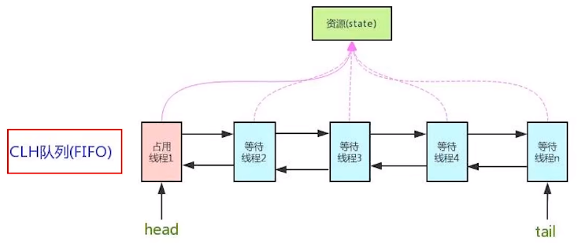

CLH：Craig、Landin and Hagersten队列，是一个单向链表，AQS中的队列是CLH变体的虚拟双向队列FIFO。

## AQS能干嘛

AQS为什么是JUC内容中最重要的基石？

和AQS有关的

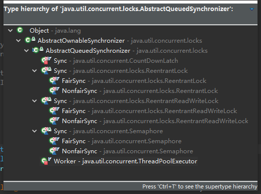


**进一步理解锁和同步器的关系**

- 锁，面向锁的**使用者** - 定义了程序员和锁交互的使用层APl，隐藏了实现细节，你调用即可
- 同步器，面向锁的**实现者** - 比如Java并发大神DougLee，提出统一规范并简化了锁的实现，屏蔽了同步状态管理、阻塞线程排队和通知、唤醒机制等。

**能干嘛？**

加锁会导致阻塞 - 有阻塞就需要排队，实现排队必然需要有某种形式的队列来进行管理

**解释说明**

抢到资源的线程直接使用处理业务逻辑，抢不到资源的必然涉及一种**排队等候机制**。抢占资源失败的线程继续去等待(类似银行业务办理窗口都满了，暂时没有受理窗口的顾客只能去候客区排队等候)，但等候线程仍然保留获取锁的可能且获取锁流程仍在继续(候客区的顾客也在等着叫号，轮到了再去受理窗口办理业务)。

既然说到了排队等候机制，那么就一定会有某种队列形成，这样的队列是什么数据结构呢?

如果共享资源被占用，就需要一定的**阻塞等待唤醒机制**来保证锁分配。这个机制主要用的是CLH队列的变体实现的，将暂时获取不到锁的线程加入到队列中，这个队列就是AQS的抽象表现。它将请求共享资源的线程封装成队列的结点(Node)，通过CAS、自旋以及LockSupportpark)的方式，维护state变量的状态，使并发达到同步的控制效果。


## AQS源码体系-上

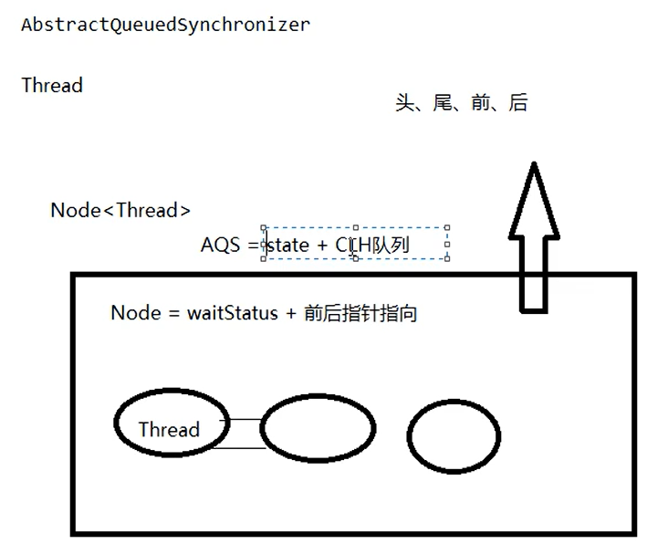

>Provides a framework for implementing blocking locks and related synchronizers (semaphores, events, etc) that rely on first-in-first-out (FIFO) wait queues. This class is designed to be a useful basis for most kinds of synchronizers that rely on a single atomic int value to represent state. Subclasses must define the protected methods that change this state, and which define what that state means in terms of this object being acquired or released. Given these, the other methods in this class carry out all queuing and blocking mechanics. Subclasses can maintain other state fields, but only the atomically updated int value manipulated using methods getState(), setState(int) and compareAndSetState(int, int) is tracked with respect to synchronization.
>
>AbstractQueuedSynchronizer (Java Platform SE 8 )
>
>提供一个框架来实现阻塞锁和依赖先进先出（FIFO）等待队列的相关同步器（信号量、事件等）。此类被设计为大多数类型的同步器的有用基础，这些同步器依赖于单个原子“int”值来表示状态。子类必须定义更改此状态的受保护方法，以及定义此状态在获取或释放此对象方面的含义。给定这些，这个类中的其他方法执行所有排队和阻塞机制。子类可以维护其他状态字段，但是只有使用方法getState（）、setState（int）和compareAndSetState（int，int）操作的原子更新的’int’值在同步方面被跟踪。

有阻塞就需要排队，实现排队必然需要队列

AQS使用一个volatile的int类型的成员变量来表示同步状态，通过内置的FIFO队列来完成资源获取的排队工作将每条要去抢占资源的线程封装成一个Node，节点来实现锁的分配，通过CAS完成对State值的修改。

```java
public abstract class AbstractQueuedSynchronizer
    extends AbstractOwnableSynchronizer
    implements java.io.Serializable {

    private static final long serialVersionUID = 7373984972572414691L;

     * Creates a new {@code AbstractQueuedSynchronizer} instance
    protected AbstractQueuedSynchronizer() { }

     * Wait queue node class.
    static final class Node {

     * Head of the wait queue, lazily initialized.  Except for
    private transient volatile Node head;

     * Tail of the wait queue, lazily initialized.  Modified only via
    private transient volatile Node tail;

     * The synchronization state.
    private volatile int state;

     * Returns the current value of synchronization state.
    protected final int getState() {

     * Sets the value of synchronization state.
    protected final void setState(int newState) {

     * Atomically sets synchronization state to the given updated
    protected final boolean compareAndSetState(int expect, int update) {
         
    ...
}   
```

## AQS源码体系-下

**AQS自身**

AQS的int变量 - AQS的同步状态state成员变量

```java
public abstract class AbstractQueuedSynchronizer
    extends AbstractOwnableSynchronizer
    implements java.io.Serializable {

    ...

     * The synchronization state.
    private volatile int state;
    
    ...
}
```

state成员变量相当于银行办理业务的受理窗口状态。

- 零就是没人，自由状态可以办理
- 大于等于1，有人占用窗口，等着去

AQS的CLH队列

- CLH队列(三个大牛的名字组成)，为一个双向队列
- 银行候客区的等待顾客

>The wait queue is a variant of a “CLH” (Craig, Landin, and Hagersten) lock queue. CLH locks are normally used forspinlocks. We instead use them for blocking synchronizers, butuse the same basic tactic of holding some of the controlinformation about a thread in the predecessor of its node. A"status" field in each node keeps track of whether a threadshould block. A node is signalled when its predecessorreleases. Each node of the queue otherwise serves as aspecific-notification-style monitor holding a single waiting thread. The status field does NOT control whether threads aregranted locks etc though. A thread may try to acquire if it isfirst in the queue. But being first does not guarantee success;it only gives the right to contend. So the currently releasedcontender thread may need to rewait.To enqueue into a CLH lock, you atomically splice it in as new tail. To dequeue, you just set the head field. 本段文字出自AbstractQueuedSynchronizer内部类Node源码注释

**小总结**

- 有阻塞就需要排队，实现排队必然需要队列
- state变量+CLH变种的双端队列

AbstractQueuedSynchronizer内部类Node源码

```java
public abstract class AbstractQueuedSynchronizer
    extends AbstractOwnableSynchronizer
    implements java.io.Serializable {

    ...

     * Creates a new {@code AbstractQueuedSynchronizer} instance
    protected AbstractQueuedSynchronizer() { }

     * Wait queue node class.
    static final class Node {
        //表示线程以共享的模式等待锁
        /** Marker to indicate a node is waiting in shared mode */
        static final Node SHARED = new Node();
        
        //表示线程正在以独占的方式等待锁
        /** Marker to indicate a node is waiting in exclusive mode */
        static final Node EXCLUSIVE = null;

        //线程被取消了
        /** waitStatus value to indicate thread has cancelled */
        static final int CANCELLED =  1;

        //后继线程需要唤醒
        /** waitStatus value to indicate successor's thread needs unparking */
        static final int SIGNAL    = -1;
        
        //等待condition唤醒
        /** waitStatus value to indicate thread is waiting on condition */
        static final int CONDITION = -2;
        
        //共享式同步状态获取将会无条件地传播下去
        * waitStatus value to indicate the next acquireShared should     
        static final int PROPAGATE = -3;

        //当前节点在队列中的状态（重点）
        //说人话：
        //等候区其它顾客(其它线程)的等待状态
        //队列中每个排队的个体就是一个Node
        //初始为0，状态上面的几种
         * Status field, taking on only the values:
        volatile int waitStatus;

        //前驱节点（重点）
         * Link to predecessor node that current node/thread relies on
        volatile Node prev;

        //后继节点（重点）
         * Link to the successor node that the current node/thread
        volatile Node next;

        //表示处于该节点的线程
         * The thread that enqueued this node.  Initialized on
        volatile Thread thread;

        //指向下一个处于CONDITION状态的节点
         * Link to next node waiting on condition, or the special
        Node nextWaiter;

         * Returns true if node is waiting in shared mode.
        final boolean isShared() {

        //返回前驱节点，没有的话抛出npe
         * Returns previous node, or throws NullPointerException if null.
        final Node predecessor() throws NullPointerException {

        Node() {    // Used to establish initial head or SHARED marker

        Node(Thread thread, Node mode) {     // Used by addWaiter

        Node(Thread thread, int waitStatus) { // Used by Condition
    }
	...
}
```

AQS同步队列的基本结构

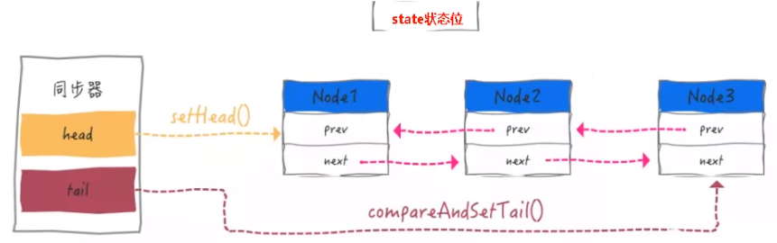

## ReentrantLock代码解析

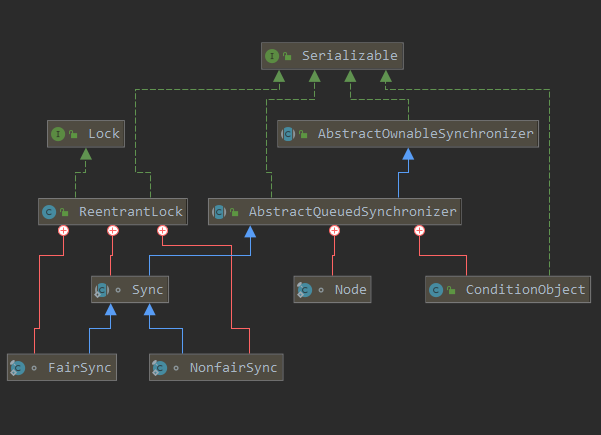

### lock()流程

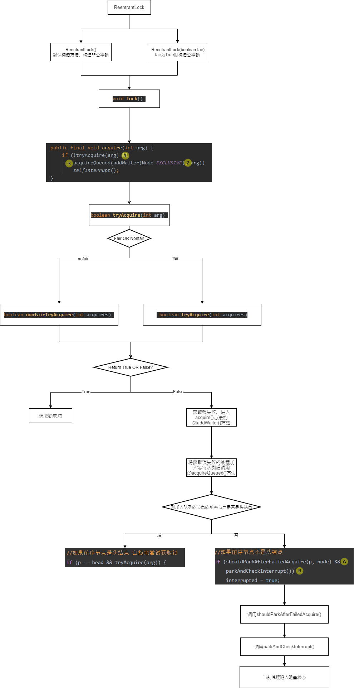

- 
  nonfairTryAcquire
  

  ```java
  //被NonfairSync的tryAcquire()调用
  final boolean nonfairTryAcquire(int acquires) {
      		//获取当前线程
              final Thread current = Thread.currentThread();
      		//获取当前RentrantLock state状态位，若为0则为第一个获取锁的线程;若>0则说明已有线程获取过锁
              int c = getState();
      		//当前线程state为0的话，先尝试获取锁，成功返回true
              if (c == 0) {
                  //使用CAS设置状态位，并将锁持有线程设置为当前线程
                  if (compareAndSetState(0, acquires)) {
                      setExclusiveOwnerThread(current);
                      return true;
                  }
              }
      		//若不为0，判断持有锁的线程是否为当前线程，若为当前线程则依然可以获取锁，将state位+1 返回true
              else if (current == getExclusiveOwnerThread()) {
                  int nextc = c + acquires;
                  if (nextc < 0) // overflow
                      throw new Error("Maximum lock count exceeded");
                  setState(nextc);
                  return true;
              }
      		//否则获取失败，返回false
              return false;
          }
  ```
  
- tryAcquire

  ```java
  //被FairSync的tryAcquire()调用 
  protected final boolean tryAcquire(int acquires) {
      		//获取当前线程
              final Thread current = Thread.currentThread();
              //获取当前RentrantLock state状态位，若为0则为第一个获取锁的线程;若>0则说明已有线程获取过锁
              int c = getState();
      		//当前线程state为0的话 直接尝试获取锁，成功返回true
              if (c == 0) {
                  //和非公平锁的唯一差别！在尝试获取锁之前先检查队列中是否有排队线程，没有的情况下才尝试使用CAS获取锁，有的话放弃获取锁！
                  if (!hasQueuedPredecessors() &&
                      compareAndSetState(0, acquires)) {
                      setExclusiveOwnerThread(current);
                      return true;
                  }
              }
            //若不为0，判断持有锁的线程是否为当前线程，若为当前线程则依然可以获取锁，将state位+1 返回true
              else if (current == getExclusiveOwnerThread()) {
                  int nextc = c + acquires;
                  if (nextc < 0)
                      throw new Error("Maximum lock count exceeded");
                  setState(nextc);
                  return true;
              }
      		//否则获取失败，返回false
              return false;
          }
      }
  ```

  

- addWaiter

  ```java
  private Node addWaiter(Node mode) {
      	//新建一个节点对象 Node的waitstatus为Node.EXCLUSIVE(null)，Thread为尝试获取锁失败，要进入等待队列的线程
          Node node = new Node(mode);
  		//进行自旋
          for (;;) {
              //获取CLH队列（存放等待线程）尾结点
              Node oldTail = tail;
              //oldTail不为null，队列已经初始化
              if (oldTail != null) {
                  //将当前节点的前向指针指向尾结点
                  node.setPrevRelaxed(oldTail);
                  //使用CAS将等待队列的尾结点设置为当前节点
                  if (compareAndSetTail(oldTail, node)) {
                      //设置成功则将旧的尾结点的后向指针指向当前节点，并返回当前节点
                      oldTail.next = node;
                      return node;
                  }
                  //tail是null的话，说明CLH队列为空，调用初始化initializeSyncQueue()队列，初始化成功后自旋进入oldTail!=null分支
              } else {
                  initializeSyncQueue();
              }
          }
      }
  ```

  - initializeSyncQueue()

    ```java
    //CLH队列的初始化方法 
    private final void initializeSyncQueue() {
            Node h;
         	//新建一个傀儡节点（dummy），将tail和head指针都指向该傀儡节点
            if (HEAD.compareAndSet(this, null, (h = new Node())))
                tail = h;
        }
    
    ```

- acquireQueued

  ```java
  //对刚加入等待队列里的线程进一步处理
  final boolean acquireQueued(final Node node, int arg) {
          try {
              boolean interrupted = false;
              //自旋！！
              for (;;) {
                  //获取刚加入节点的前序节点
                  final Node p = node.predecessor();
                  //如果前序节点是头结点 自旋地尝试获取锁
                  if (p == head && tryAcquire(arg)) {
                      //接下来是获取锁成功后的一系列操作
                      //将当前节点设置为傀儡节点（CLH队列头结点实际上就是一个傀儡节点）
                      setHead(node);
                      //切断前序节点和当前阶段的引用，帮助GC
                      p.next = null; // help GC
                      return interrupted;
                  }
                  //如果前序节点不是头结点
                  if (shouldParkAfterFailedAcquire(p, node) && //查看前序节点的waitStatus状态以确定是否阻塞当前线程，该方法会处理waitStatus设置为CANCELLED的节点
                      parkAndCheckInterrupt()) //若获取锁失败，则当前线程会在此处陷入阻塞 等待被唤醒，唤醒后再次进入自旋尝试获取锁
                      interrupted = true;
              }
          } catch (Throwable t) {
              cancelAcquire(node);
              throw t;
          }
      }
  ```

  - setHead()

    ```java
    //将一个节点设置为头结点（傀儡节点）
    private void setHead(Node node) {
            //将头指针指向当前节点
            head = node;
       		//将当前节点的Thread设置为null
            node.thread = null;
       		//将当前节点的前序节点设置为null
            node.prev = null;
        }
    ```

  - shouldParkAfterFailedAcquire

    ```java
    private static boolean shouldParkAfterFailedAcquire(Node pred, Node node) {
            //获取前序节点的waitStatus
            int ws = pred.waitStatus;
            //若前序节点的状态为SIGNAL（意味着有节点需要被唤醒），则当前节点已被设置为需要唤醒
            if (ws == Node.SIGNAL)
                return true;
        	//若前序节点状态为CANCELLED(>0),将该前序节点移出队列，直到遇到waitStatus不为CANCELLED的节点
            if (ws > 0) {
                do {
                    node.prev = pred = pred.prev; //先执行 pred = pred.prev，再执行 node.prev = pred
                } while (pred.waitStatus > 0);
                pred.next = node;
            } else {
               //不是上面两种情况的话，那么前序节点的waitStatus一定是0 或者PROPAGATE，所以将前序节点的waitStatus通过CAS设置为SIGNAL，以表示有后序线程需要唤醒
                pred.compareAndSetWaitStatus(ws, Node.SIGNAL);
            }
            return false;
        }
    ```
    
  - parkAndCheckInterrupt
  
    ```java
    //已确定前序节点的状态为SIGNAL，则当前线程可以通过park()方法陷入阻塞状态
    private final boolean parkAndCheckInterrupt() {
            LockSupport.park(this);
        	//返回当前线程的中断记录
            return Thread.interrupted(); //这里涉及到java协作式中断的知识
        }
    ```
  
    

### unlock()流程

```java
  public void unlock() {
        sync.release(1);
    }

```


- release

  ```java
      public final boolean release(int arg) {
          //c尝试释放锁
          if (tryRelease(arg)) {
              //获取CLH队列头结点
              Node h = head;
              //若头结点不为空，且waitStatus不为0 则唤醒被阻塞在CLH队列中的线程
              if (h != null && h.waitStatus != 0)
                  unparkSuccessor(h);
              return true;
          }
          return false;
      }
  
  ```

  

  - unparkSuccessor

    ```java
    private void unparkSuccessor(Node node) {
    
        	//获取当前节点waitStatus
            int ws = node.waitStatus;
        	//将当前节点waitStatus修改为0
            if (ws < 0)
                node.compareAndSetWaitStatus(ws, 0);
    
            //获取当前的后续节点
            Node s = node.next;
        	//如果下个节点是null或者下个节点被cancelled，就找到队列最开始的非cancelled的节点
            if (s == null || s.waitStatus > 0) {
                s = null;
                // 就从尾部节点开始找，到队首，找到队列第一个waitStatus<0的节点。
                for (Node p = tail; p != node && p != null; p = p.prev)
                    if (p.waitStatus <= 0)
                        s = p;
            }
        	// 如果当前节点的下个节点不为空，而且状态<=0，就把当前节点unpark
            if (s != null)
                LockSupport.unpark(s.thread);
        }
    
    ```

    

## ReentrantLock的示例程序

带入一个银行办理业务的案例来模拟我们的AQS 如何进行线程的管理和通知唤醒机制，3个线程模拟3个来银行网点，受理窗口办理业务的顾客。

```java
import java.util.concurrent.TimeUnit;
import java.util.concurrent.locks.ReentrantLock;

public class AQSDemo {
	
	public static void main(String[] args) {
		ReentrantLock lock = new ReentrantLock();
		
		//带入一个银行办理业务的案例来模拟我们的AQs 如何进行线程的管理和通知唤醒机制
		//3个线程模拟3个来银行网点，受理窗口办理业务的顾客

		//A顾客就是第一个顾客，此时受理窗口没有任何人，A可以直接去办理
		new Thread(()->{
			lock.lock();
			try {
				System.out.println(Thread.currentThread().getName() + " come in.");
				
				try {
					TimeUnit.SECONDS.sleep(5);//模拟办理业务时间
				} catch (InterruptedException e) {
					e.printStackTrace();
				}
			} finally {
				lock.unlock();
			}
		}, "Thread A").start();
		
		//第2个顾客，第2个线程---->，由于受理业务的窗口只有一个(只能一个线程持有锁)，此代B只能等待，
		//进入候客区
		new Thread(()->{
			lock.lock();
			try {
				System.out.println(Thread.currentThread().getName() + " come in.");
				
			} finally {
				lock.unlock();
			}
		}, "Thread B").start();
		
		
		//第3个顾客，第3个线程---->，由于受理业务的窗口只有一个(只能一个线程持有锁)，此代C只能等待，
		//进入候客区
		new Thread(()->{
			lock.lock();
			try {
				System.out.println(Thread.currentThread().getName() + " come in.");
				
			} finally {
				lock.unlock();
			}
		}, "Thread C").start();
	}
}

```

程序初始状态方便理解图

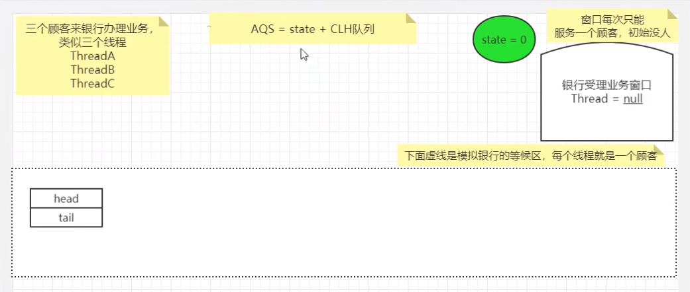

启动程序，首先是运行线程A，ReentrantLock默认是选用非公平锁。

```java
public class ReentrantLock implements Lock, java.io.Serializable {
    
    ...
        
    * Acquires the lock.
    public void lock() {
        sync.lock();//<------------------------注意，我们从这里入手,一开始将线程A的
    }
    
    abstract static class Sync extends AbstractQueuedSynchronizer {
        
        ...

        //被NonfairSync的tryAcquire()调用
        final boolean nonfairTryAcquire(int acquires) {
            final Thread current = Thread.currentThread();
            int c = getState();
            if (c == 0) {
                if (compareAndSetState(0, acquires)) {
                    setExclusiveOwnerThread(current);
                    return true;
                }
            }
            else if (current == getExclusiveOwnerThread()) {
                int nextc = c + acquires;
                if (nextc < 0) // overflow
                    throw new Error("Maximum lock count exceeded");
                setState(nextc);
                return true;
            }
            return false;
        }
        ...

    }
    
    
	//非公平锁
	static final class NonfairSync extends Sync {
        private static final long serialVersionUID = 7316153563782823691L;

        /**
         * Performs lock.  Try immediate barge, backing up to normal
         * acquire on failure.
         */
        final void lock() {//<----线程A的lock.lock()调用该方法
            if (compareAndSetState(0, 1))//AbstractQueuedSynchronizer的方法,刚开始这方法返回true
                setExclusiveOwnerThread(Thread.currentThread());//设置独占的所有者线程，显然一开始是线程A
            else
                acquire(1);//稍后紧接着的线程B将会调用该方法。
        }

        //acquire()将会间接调用该方法
        protected final boolean tryAcquire(int acquires) {
            return nonfairTryAcquire(acquires);//调用父类Sync的nonfairTryAcquire()
        }
        

        
    }
    
    ...
}
```

线程A开始办业务了。

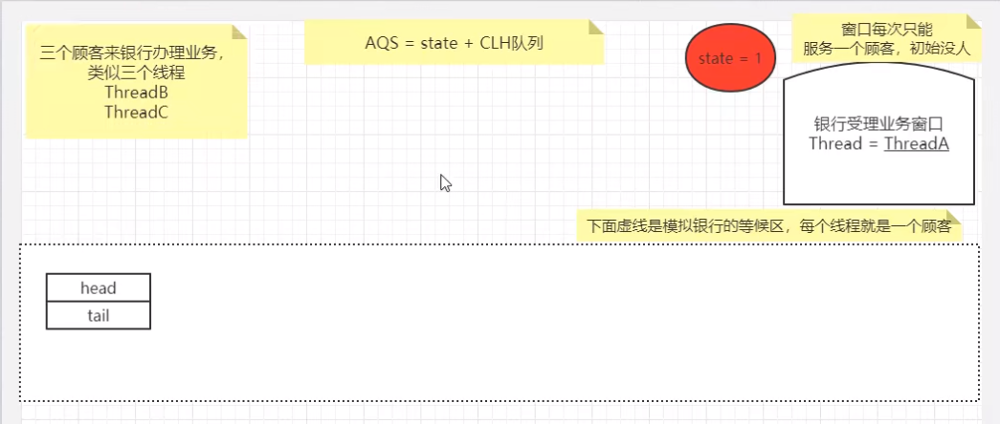

轮到线程B运行

```java
public class ReentrantLock implements Lock, java.io.Serializable {
    
    ...
        
    * Acquires the lock.
    public void lock() {
        sync.lock();//<------------------------注意，我们从这里入手,线程B的执行这
    }
    
	//非公平锁
	static final class NonfairSync extends Sync {
        private static final long serialVersionUID = 7316153563782823691L;

        /**
         * Performs lock.  Try immediate barge, backing up to normal
         * acquire on failure.
         */
        final void lock() {//<-------------------------线程B的lock.lock()调用该方法
            if (compareAndSetState(0, 1))//这是预定线程A还在工作，这里返回false
                setExclusiveOwnerThread(Thread.currentThread());//
            else
                acquire(1);//线程B将会调用该方法，该方法在AbstractQueuedSynchronizer，
            			   //它会调用本类的tryAcquire()方法
        }

        //acquire()将会间接调用该方法
        protected final boolean tryAcquire(int acquires) {
            return nonfairTryAcquire(acquires);//调用父类Sync的nonfairTryAcquire()
        }
    }

    //非公平锁与公平锁的公共父类
     * Base of synchronization control for this lock. Subclassed
    abstract static class Sync extends AbstractQueuedSynchronizer {
    
        //acquire()将会间接调用该方法
    	...
        final boolean nonfairTryAcquire(int acquires) {
            final Thread current = Thread.currentThread();//这里是线程B
            int c = getState();//线程A还在工作，c=>1
            if (c == 0) {//false
                if (compareAndSetState(0, acquires)) {
                    setExclusiveOwnerThread(current);
                    return true;
                }
            }
            else if (current == getExclusiveOwnerThread()) {//(线程B == 线程A) => false
                int nextc = c + acquires;//+1
                if (nextc < 0) // overflow
                    throw new Error("Maximum lock count exceeded");
                setState(nextc);
                return true;
            }
            return false;//最终返回false
        } 
        ...
    
    }
    
    ...
}
```

```java
public abstract class AbstractQueuedSynchronizer
    extends AbstractOwnableSynchronizer
    implements java.io.Serializable {

	...

     * Acquires in exclusive mode, ignoring interrupts.  Implemented
    public final void acquire(int arg) {
        if (!tryAcquire(arg) &&//线程B调用非公平锁的tryAcquire(), 最终返回false，加上!,也就是true,也就是还要执行下面两行语句
            acquireQueued(addWaiter(Node.EXCLUSIVE), arg))
            selfInterrupt();
    }
    
    ...
}
```

另外

假设线程B，C还没启动，正在工作线程A重新尝试获得锁，也就是调用lock.lock()多一次

```java
   //非公平锁与公平锁的公共父类fa
     * Base of synchronization control for this lock. Subclassed
    abstract static class Sync extends AbstractQueuedSynchronizer {
    
    	...
        final boolean nonfairTryAcquire(int acquires) {
            final Thread current = Thread.currentThread();//这里是线程A
            int c = getState();//线程A还在工作，c=>1；如果线程A恰好运行到在这工作完了，c=>0，这时它又要申请锁的话
            if (c == 0) {//线程A正在工作为false;如果线程A恰好工作完，c=>0，这时它又要申请锁的话,则为true
                if (compareAndSetState(0, acquires)) {//线程A重新获得锁
                    setExclusiveOwnerThread(current);//这里相当于NonfairSync.lock()另一重设置吧！
                    return true;
                }
            }
            else if (current == getExclusiveOwnerThread()) {//(线程A == 线程A) => true
                int nextc = c + acquires;//1+1=>nextc=2
                if (nextc < 0) // overflow
                    throw new Error("Maximum lock count exceeded");
                setState(nextc);//state=2,说明要unlock多两次吧（现在盲猜）
                return true;//返回true
            }
            return false;
        } 
        ...
    
    }
```

线程B加入等待队列。

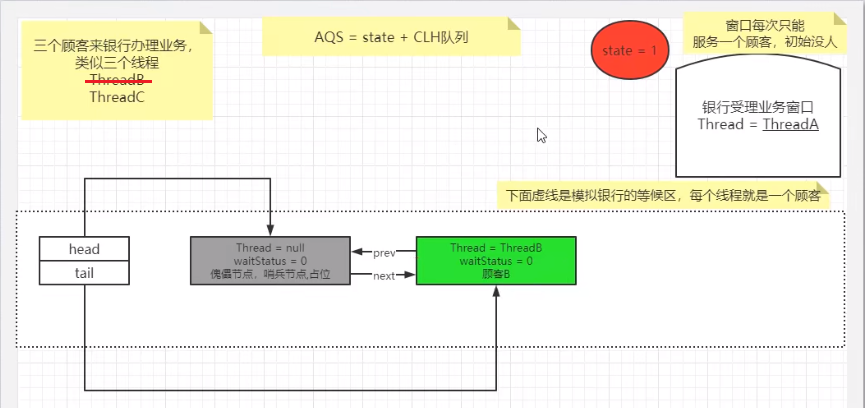

线程A依然工作，线程C如线程B那样炮制加入等待队列。

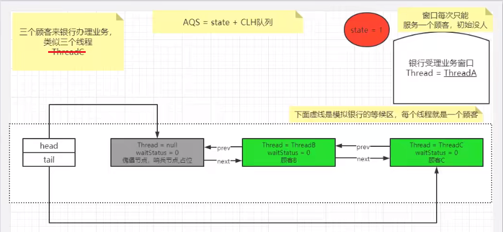

双向链表中，第一个节点为虚节点(也叫哨兵节点)，其实并不存储任何信息，只是占位。真正的第一个有数据的节点，是从第二个节点开始的。

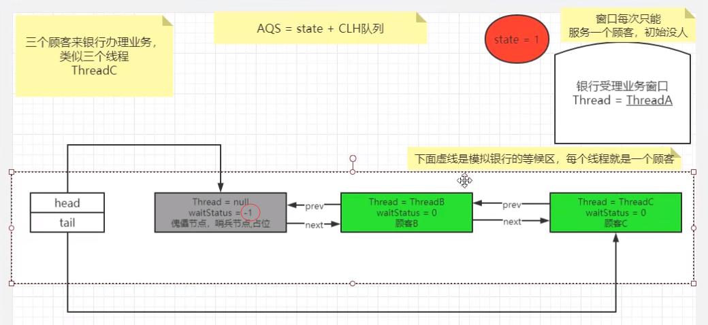

图中的傀儡节点的waitStatus由0变为-1（Node.SIGNAL）。

接下来讨论ReentrantLock.unLock()方法。假设线程A工作结束，调用unLock()，释放锁占用。

线程A结束工作，调用unlock()的tryRelease()后的状态，state由1变为0，exclusiveOwnerThread由线程A变为null。

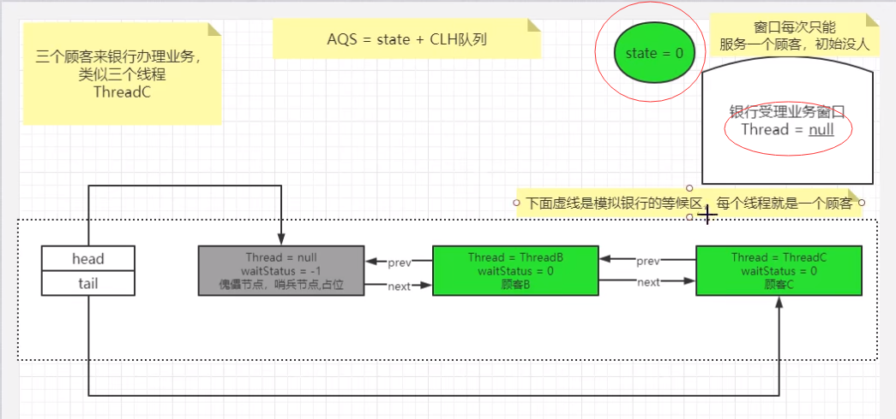

## 不同版本Spring的AOP执行顺序

### Spring4.x

```java
Spring Verision : 4.3.13.RELEASE, Sring Boot Version : 1.5.9.RELEASE.

我是环绕通知之前AAA
********@Before我是前置通知
===>CalcServiceImpl被调用，计算结果为：5
我是环绕通知之后BBB
********@After我是后置通知
********@AfterReturning我是返回后通知
```

```java
Spring Verision : 4.3.13.RELEASE, Sring Boot Version : 1.5.9.RELEASE.

我是环绕通知之前AAA
********@Before我是前置通知
********@After我是后置通知
********@AfterThrowing我是异常通知

java.lang.ArithmeticException: / by zero
	at com.lun.interview.service.CalcServiceImpl.div(CalcServiceImpl.java:10)
	at sun.reflect.NativeMethodAccessorImpl.invoke0(Native Method)
	at sun.reflect.NativeMethodAccessorImpl.invoke(NativeMethodAccessorImpl.java:62)
	at sun.reflect.DelegatingMethodAccessorImpl.invoke(DelegatingMethodAccessorImpl.java:43)
	at java.lang.reflect.Method.invoke(Method.java:498)
	...
```

### Spring5.x

```java
Spring Verision : 5.2.8.RELEASE, Sring Boot Version : 2.3.3.RELEASE.

我是环绕通知之前AAA
********@Before我是前置通知
===>CalcServiceImpl被调用，计算结果为：5
********@AfterReturning我是返回后通知
********@After我是后置通知
我是环绕通知之后BBB
```

```java
Spring Verision : 5.2.8.RELEASE, Sring Boot Version : 2.3.3.RELEASE.

我是环绕通知之前AAA
********@Before我是前置通知
********@AfterThrowing我是异常通知
********@After我是后置通知

java.lang.ArithmeticException: / by zero
	at com.lun.interview.service.CalcServiceImpl.div(CalcServiceImpl.java:10)
	at com.lun.interview.service.CalcServiceImpl$$FastClassBySpringCGLIB$$355acbc4.invoke(<generated>)
	at org.springframework.cglib.proxy.MethodProxy.invoke(MethodProxy.java:218)
	at org.springframework.aop.framework.CglibAopProxy$CglibMethodInvocation.invokeJoinpoint(CglibAopProxy.java:771)
```

## Spring的循环依赖

- 你解释下spring中的三级缓存？
- 三级缓存分别是什么？三个Map有什么异同？
- 什么是循环依赖？请你谈谈？看过spring源码吗？
- 如何检测是否存在循环依赖？实际开发中见过循环依赖的异常吗？
- 多例的情况下，循环依赖问题为什么无法解决？

什么是循环依赖？

多个bean之间相互依赖，形成了一个闭环。比如：A依赖于B、B依赖于C、C依赖于A。

通常来说，如果问Spring容器内部如何解决循环依赖，一定是指默认的单例Bean中，属性互相引用的场景。

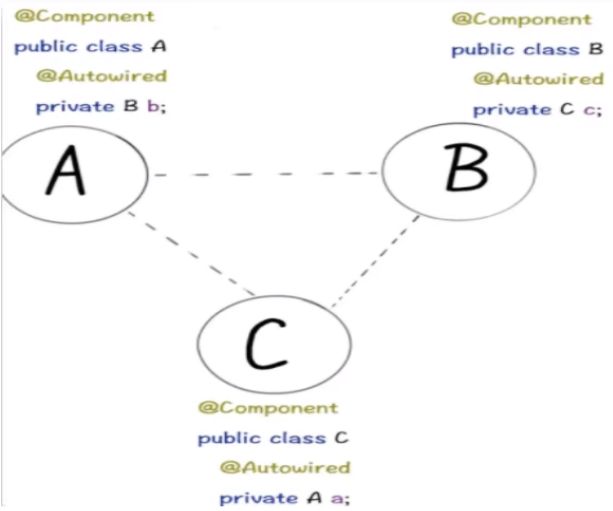

我们AB循环依赖问题只要A的**注入方式是setter且singleton** ，就不会有循环依赖问题。

### Spring循环依赖bug演示

beans：A，B

```java
public class A {

	private B b;

	public B getB() {
		return b;
	}

	public void setB(B b) {
		this.b = b;
        System.out.println("A call setB.");
	}
}
```

```java
public class B {

	private A a;

	public A getA() {
		return a;
	}

	public void setA(A a) {
		this.a = a;
        System.out.println("B call setA.");
	}	
}
```

beans.xml

```xml
<?xml version="1.0" encoding="UTF-8" ?>
<beans xmlns="http://www.springframework.org/schema/beans"
	xmlns:xsi="http://www.w3.org/2001/XMLSchema-instance" xmlns:p="http://www.springframework.org/schema/p"
	xmlns:context="http://www.springframework.org/schema/context"
	xmlns:aop="http://www.springframework.org/schema/aop" xmlns:tx="http://www.springframework.org/schema/tx"
	xsi:schemaLocation="http://www.springframework.org/schema/beans 
       http://www.springframework.org/schema/beans/spring-beans-4.0.xsd
       http://www.springframework.org/schema/context 
       http://www.springframework.org/schema/context/spring-context-4.0.xsd
       http://www.springframework.org/schema/tx 
       http://www.springframework.org/schema/tx/spring-tx-4.0.xsd
       http://www.springframework.org/schema/aop
       http://www.springframework.org/schema/aop/spring-aop-4.0.xsd">
    
    <bean id="a" class="com.lun.interview.circular.A">
    	<property name="b" ref="b"></property>
    </bean>
    <bean id="b" class="com.lun.interview.circular.B">
    	<property name="a" ref="a"></property>
    </bean>
    
</beans>
```

运行类

```java
import org.springframework.context.ApplicationContext;
import org.springframework.context.support.ClassPathXmlApplicationContext;

public class ClientSpringContainer {

	public static void main(String[] args) {
		ApplicationContext context = new ClassPathXmlApplicationContext("beans.xml");
		A a = context.getBean("a", A.class);
		B b = context.getBean("b", B.class);
	}
}
```

输出结果

```java
00:00:25.649 [main] DEBUG org.springframework.context.support.ClassPathXmlApplicationContext - Refreshing org.springframework.context.support.ClassPathXmlApplicationContext@6d86b085
00:00:25.828 [main] DEBUG org.springframework.beans.factory.xml.XmlBeanDefinitionReader - Loaded 2 bean definitions from class path resource [beans.xml]
00:00:25.859 [main] DEBUG org.springframework.beans.factory.support.DefaultListableBeanFactory - Creating shared instance of singleton bean 'a'
00:00:25.875 [main] DEBUG org.springframework.beans.factory.support.DefaultListableBeanFactory - Creating shared instance of singleton bean 'b'
B call setA.
A call setB.
```


默认的单例(Singleton)的场景是**支持**循环依赖的，不报错


原型(Prototype)的场景是不支持循环依赖的，会报错

beans.xml

```xml
<?xml version="1.0" encoding="UTF-8" ?>
<beans xmlns="http://www.springframework.org/schema/beans"
	xmlns:xsi="http://www.w3.org/2001/XMLSchema-instance" xmlns:p="http://www.springframework.org/schema/p"
	xmlns:context="http://www.springframework.org/schema/context"
	xmlns:aop="http://www.springframework.org/schema/aop" xmlns:tx="http://www.springframework.org/schema/tx"
	xsi:schemaLocation="http://www.springframework.org/schema/beans 
       http://www.springframework.org/schema/beans/spring-beans-4.0.xsd
       http://www.springframework.org/schema/context 
       http://www.springframework.org/schema/context/spring-context-4.0.xsd
       http://www.springframework.org/schema/tx 
       http://www.springframework.org/schema/tx/spring-tx-4.0.xsd
       http://www.springframework.org/schema/aop
       http://www.springframework.org/schema/aop/spring-aop-4.0.xsd">
    

    <bean id="a" class="com.lun.interview.circular.A" scope="prototype">
    	<property name="b" ref="b"></property>
    </bean>
    <bean id="b" class="com.lun.interview.circular.B" scope="prototype">
    	<property name="a" ref="a"></property>
    </bean>

</beans>
```

输出结果

```java
00:01:39.904 [main] DEBUG org.springframework.context.support.ClassPathXmlApplicationContext - Refreshing org.springframework.context.support.ClassPathXmlApplicationContext@6d86b085
00:01:40.062 [main] DEBUG org.springframework.beans.factory.xml.XmlBeanDefinitionReader - Loaded 2 bean definitions from class path resource [beans.xml]
Exception in thread "main" org.springframework.beans.factory.BeanCreationException: Error creating bean with name 'a' defined in class path resource [beans.xml]: Cannot resolve reference to bean 'b' while setting bean property 'b'; nested exception is org.springframework.beans.factory.BeanCreationException: Error creating bean with name 'b' defined in class path resource [beans.xml]: Cannot resolve reference to bean 'a' while setting bean property 'a'; nested exception is org.springframework.beans.factory.BeanCurrentlyInCreationException: Error creating bean with name 'a': Requested bean is currently in creation: Is there an unresolvable circular reference?
	at org.springframework.beans.factory.support.BeanDefinitionValueResolver.resolveReference(BeanDefinitionValueResolver.java:342)
	at org.springframework.beans.factory.support.BeanDefinitionValueResolver.resolveValueIfNecessary(BeanDefinitionValueResolver.java:113)
	at org.springframework.beans.factory.support.AbstractAutowireCapableBeanFactory.applyPropertyValues(AbstractAutowireCapableBeanFactory.java:1697)
	at org.springframework.beans.factory.support.AbstractAutowireCapableBeanFactory.populateBean(AbstractAutowireCapableBeanFactory.java:1442)
	at org.springframework.beans.factory.support.AbstractAutowireCapableBeanFactory.doCreateBean(AbstractAutowireCapableBeanFactory.java:593)
	at org.springframework.beans.factory.support.AbstractAutowireCapableBeanFactory.createBean(AbstractAutowireCapableBeanFactory.java:516)
	at org.springframework.beans.factory.support.AbstractBeanFactory.doGetBean(AbstractBeanFactory.java:342)
	at org.springframework.beans.factory.support.AbstractBeanFactory.getBean(AbstractBeanFactory.java:207)
	at org.springframework.context.support.AbstractApplicationContext.getBean(AbstractApplicationContext.java:1115)
	at com.lun.interview.circular.ClientSpringContainer.main(ClientSpringContainer.java:10)
Caused by: org.springframework.beans.factory.BeanCreationException: Error creating bean with name 'b' defined in class path resource [beans.xml]: Cannot resolve reference to bean 'a' while setting bean property 'a'; nested exception is org.springframework.beans.factory.BeanCurrentlyInCreationException: Error creating bean with name 'a': Requested bean is currently in creation: Is there an unresolvable circular reference?
	at org.springframework.beans.factory.support.BeanDefinitionValueResolver.resolveReference(BeanDefinitionValueResolver.java:342)
	at org.springframework.beans.factory.support.BeanDefinitionValueResolver.resolveValueIfNecessary(BeanDefinitionValueResolver.java:113)
	at org.springframework.beans.factory.support.AbstractAutowireCapableBeanFactory.applyPropertyValues(AbstractAutowireCapableBeanFactory.java:1697)
	at org.springframework.beans.factory.support.AbstractAutowireCapableBeanFactory.populateBean(AbstractAutowireCapableBeanFactory.java:1442)
	at org.springframework.beans.factory.support.AbstractAutowireCapableBeanFactory.doCreateBean(AbstractAutowireCapableBeanFactory.java:593)
	at org.springframework.beans.factory.support.AbstractAutowireCapableBeanFactory.createBean(AbstractAutowireCapableBeanFactory.java:516)
	at org.springframework.beans.factory.support.AbstractBeanFactory.doGetBean(AbstractBeanFactory.java:342)
	at org.springframework.beans.factory.support.AbstractBeanFactory.getBean(AbstractBeanFactory.java:202)
	at org.springframework.beans.factory.support.BeanDefinitionValueResolver.resolveReference(BeanDefinitionValueResolver.java:330)
	... 9 more
Caused by: org.springframework.beans.factory.BeanCurrentlyInCreationException: Error creating bean with name 'a': Requested bean is currently in creation: Is there an unresolvable circular reference?
	at org.springframework.beans.factory.support.AbstractBeanFactory.doGetBean(AbstractBeanFactory.java:268)
	at org.springframework.beans.factory.support.AbstractBeanFactory.getBean(AbstractBeanFactory.java:202)
	at org.springframework.beans.factory.support.BeanDefinitionValueResolver.resolveReference(BeanDefinitionValueResolver.java:330)
	... 17 more
```

重要结论(spring内部通过3级缓存来解决循环依赖) - DefaultSingletonBeanRegistry

只有单例的bean会通过三级缓存提前暴露来解决循环依赖的问题，而非单例的bean，每次从容器中获取都是一个新的对象，都会重新创建，所以非单例的bean是没有缓存的，不会将其放到三级缓存中。

第一级缓存（也叫单例池）singletonObjects：存放已经经历了完整生命周期的Bean对象。

第二级缓存：earlySingletonObjects，存放早期暴露出来的Bean对象，Bean的生命周期未结束（属性还未填充完。

第三级缓存：Map<String, ObjectFactory<?>> singletonFactories，存放可以生成Bean的工厂。

```java
package org.springframework.beans.factory.support;

...

public class DefaultSingletonBeanRegistry extends SimpleAliasRegistry implements SingletonBeanRegistry {

	...

	/** Cache of singleton objects: bean name to bean instance. */
	private final Map<String, Object> singletonObjects = new ConcurrentHashMap<>(256);

	/** Cache of singleton factories: bean name to ObjectFactory. */
	private final Map<String, ObjectFactory<?>> singletonFactories = new HashMap<>(16);

	/** Cache of early singleton objects: bean name to bean instance. */
	private final Map<String, Object> earlySingletonObjects = new HashMap<>(16);
 
    ...
    
}
```

### Spring循环依赖处理

实例化 - 内存中申请一块内存空间，如同租赁好房子，自己的家当还未搬来。

初始化属性填充 - 完成属性的各种赋值，如同装修，家具，家电进场。

3个Map和四大方法，总体相关对象

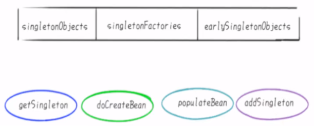

第一层singletonObjects存放的是已经初始化好了的Bean,

第二层earlySingletonObjects存放的是实例化了，但是未初始化的Bean,

第三层singletonFactories存放的是FactoryBean。假如A类实现了FactoryBean,那么依赖注入的时候不是A类，而是A类产生的Bean

**A / B两对象在三级缓存中的迁移说明**

- A创建过程中需要B，于是A将自己放到三级缓里面，去实例化B。
- B实例化的时候发现需要A，于是B先查一级缓存，没有，再查二级缓存，还是没有，再查三级缓存，找到了A然后把三级缓存里面的这个A放到二级缓存里面，并删除三级缓存里面的A。
- B顺利初始化完毕，将自己放到一级缓存里面（此时B里面的A依然是创建中状态)，然后回来接着创建A，此时B已经创建结束，直接从一级缓存里面拿到B，然后完成创建，并将A自己放到一级缓存里面。

**总结**

Spring创建 bean主要分为两个步骤，**创建原始bean对象**，接着去**填充对象属性和初始化**

每次创建 bean之前，我们都会从缓存中查下有没有该bean，因为是单例，只能有一个

当我们创建 beanA的原始对象后，并把它放到三级缓存中，接下来就该填充对象属性了，这时候发现依赖了beanB，接着就又去创建beanB，同样的流程，创建完beanB填充属性时又发现它依赖了beanA又是同样的流程，

不同的是：这时候可以在三级缓存中查到刚放进去的原始对象beanA.所以不需要继续创建，用它注入 beanB，完成 beanB的创建

既然 beanB创建好了，所以 beanA就可以完成填充属性的步骤了，接着执行剩下的逻辑，闭环完成

